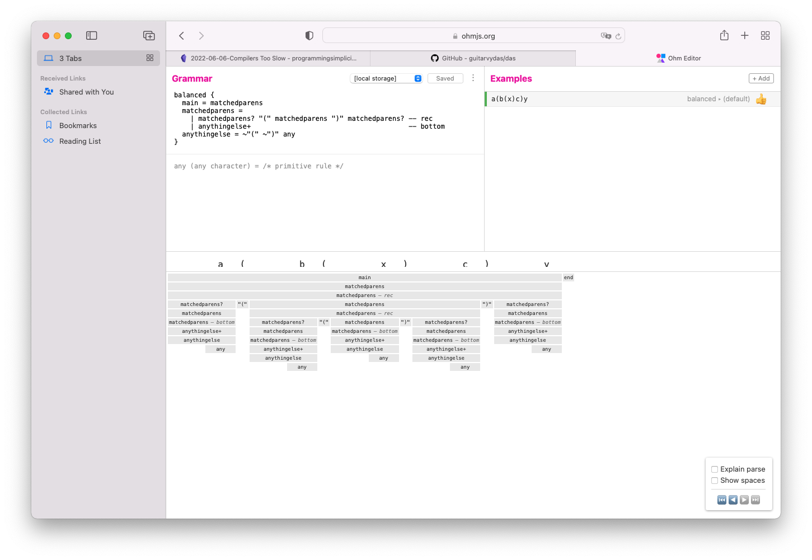

# 2022-06-07-Introduction to Parsing - Hamburger WorkbenchMy goal is to introduce the ideas of *parsing* in a gentle / frivolous way.

*Parsing* is often thought of as a compiler-only technology.

I think of *parsing* as a programming paradigm that can be applied to many kinds of programs, not just compilers.

In general, *parsing* is simply *pattern matching*.

In this book, I address only the issue of using existing parsing technology, namely Ohm-JS.  Extensions to using this existing technology to parse other formats are discussed in other books and blogs.  

The goal, then, is to, first learn how to use the basic tool, then, later, to use it to carve up other inputs.

This introduction of parsing consists of using an ad-hoc implementation of a browser-based app that performs only a simple function which is, hopefully, understandable and easy to explain.  The implementation uses Ohm-JS which is inspired by PEG (Parsing Expression Grammars)

We will discuss why Ohm-JS is better than REGEX.  REGEX is commonly found built into various popular languages (Perl, JavaScript, Python, etc.) and libraries. 
## Parsing vs REGEX

Both, REGEX and parsing are pattern-matchers.

REGEX is a DSL for pattern-matching characters in a string.

PEG is a DSL for pattern-matching characters in a string, plus, its syntax allows making recursive subroutines for matching.  

LR(k) (YACC, etc.) is *not* a DSL for pattern-matching, but is a formal description of programming languages.  LR describes languages from the bottom-up, whereas LL describes languages from the top-down.  

You can use formal descriptions of programming languages to create parsers, but this is not the same as using DSLs for generating parser code.

In many ways, the results are the same, but, not at the edges.

PEG can describe language parsers that can match balanced parentheses, e.g. "(" ... ")".

REGEX cannot describe matches that need nested parentheses, since REGEX does not use a push-down stack for recursion.

LR cannot describe languages that need matched parentheses, because of the kinds of formalisms used.

REGEX DSL syntax is succinct, albeit usually write-only.  It is easier to write a pattern match in REGEX syntax, but, it is more difficult to understand what someone else has written.

PEG syntax - akin to BNF - is less succinct but can express matches that can't be easily expressed in REGEX.

PEG can describe matches that can't be described using LL and LR language specifications.

Ohm-JS is a better PEG.

Ohm-JS (PEG) opens up new possibilities for pattern-matching languages.  Using Ohm-JS, it is possible to create syntax stacks succinctly.  This kind of matching is not easy (or impossible) with REGEX.  Language theory - LR and LL - makes it necessary to specify every nuance in the language, which makes it difficult to create syntax stacks.

For example, Ohm-JS can be used to parse matched parentheses and "anything else in between" without needing to know what the "anything else" is.  With Ohm-JS, you don't have to specify what the contents of "anything else" are, you simply specify that no parentheses appear within the "anything else".  If parentheses do appear in the "anything else", the pattern can be re-started and applied recursively.

A parenthesis matcher might be written as
```
balanced {
  main = matchedparens
  matchedparens =
    | matchedparens? "(" matchedparens ")" matchedparens? -- rec
    | anythingelse+                                       -- bottom
  anythingelse = ~"(" ~")" any
}
```
A screenshot of this pattern matcher is seen below

!
One of the possible uses of a balanced-braces parser might be to insert path-testing code after every open brace in a C program.  Using a balanced-braces parser means that you don't have to write a grammar the understands all of C, but only looks for brace brackets.


### Snake Game

```
// taken from https://ssiddique.info/20-c-game-projects-for-beginners-with-source-code.html snake game
// C program to build the complete
// snake game
#include <conio.h>
#include <stdio.h>
#include <stdlib.h>
#include <unistd.h>

int i, j, height = 20, width = 20;
int gameover, score;
int x, y, fruitx, fruity, flag;

// Function to generate the fruit
// within the boundary
void setup()
{
  gameover = 0;

  // Stores height and width
  x = height / 2;
  y = width / 2;
 label1:
  fruitx = rand() % 20;
  if (fruitx == 0)
    goto label1;
 label2:
  fruity = rand() % 20;
  if (fruity == 0)
    goto label2;
  score = 0;
}

// Function to draw the boundaries
void draw()
{
  system("cls");
  for (i = 0; i < height; i++) {
    for (j = 0; j < width; j++) {
      if (i == 0 || i == width - 1
          || j == 0
          || j == height - 1) {
        printf("#");
      }
      else {
        if (i == x && j == y)
          printf("0");
        else if (i == fruitx
                 && j == fruity)
          printf("*");
        else
          printf(" ");
      }
    }
    printf("\n");
  }

  // Print the score after the
  // game ends
  printf("score = %d", score);
  printf("\n");
  printf("press X to quit the game");
}

// Function to take the input
void input()
{
  if (kbhit()) {
    switch (getch()) {
    case 'a':
      flag = 1;
      break;
    case 's':
      flag = 2;
      break;
    case 'd':
      flag = 3;
      break;
    case 'w':
      flag = 4;
      break;
    case 'x':
      gameover = 1;
      break;
    }
  }
}

// Function for the logic behind
// each movement
void logic()
{
  sleep(0.01);
  switch (flag) {
  case 1:
    y--;
    break;
  case 2:
    x++;
    break;
  case 3:
    y++;
    break;
  case 4:
    x--;
    break;
  default:
    break;
  }

  // If the game is over
  if (x < 0 || x > height
      || y < 0 || y > width)
    gameover = 1;

  // If snake reaches the fruit
  // then update the score
  if (x == fruitx && y == fruity) {
  label3:
    fruitx = rand() % 20;
    if (fruitx == 0)
      goto label3;

    // After eating the above fruit
    // generate new fruit
  label4:
    fruity = rand() % 20;
    if (fruity == 0)
      goto label4;
    score += 10;
  }
}

// Driver Code
void main()
{
  int m, n;

  // Generate boundary
  setup();

  // Until the game is over
  while (!gameover) {

    // Function Call
    draw();
    input();
    logic();
  }
}

```

[REGEX](https://guitarvydas.github.io/2021/04/24/REGEX.html)

