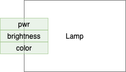
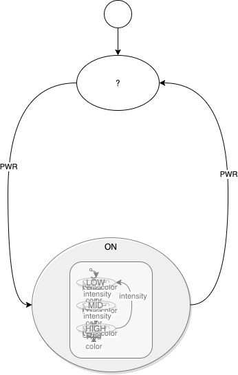
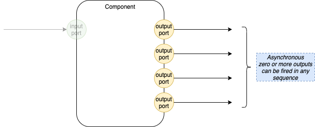
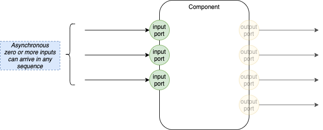

# 2022-07-31-TOL Lamp Hierarchical State Machine
TOL -> Thinking Out Loud

TOL -> WIP, showing intermediate work

Goal:
- I want to create code/classes for a very simple HSM (Hierarchical State Machine)
- I'm going to manually single-step a simple operation to see if it gives me more insight as to what is needed

---
# See Also

## 2022-07-30-Hierchical State Machine Example

# Use-Case - A Hierarchical State Machine to Control a Desk Lamp
Here’s how I think about state machines, very much based on Harel’s StateCharts.

---

# Lamp
The Problem To Be Solved:

- The Lamp has 3 toggle buttons
1. power (pwr) - toggles the lamp on and off
2. brightness - toggles the brightness of the lamp, when it is turned on
3. color - toggles the colour of the lamp when the lamp is turned on

---
# Brightness

- the lamp can be “dim”, “MID” and “HIGH” brightness

---
# Color
The lamp can be
- yellow
- green
- red

 ---
# Lamp Operation

When the lamp is turned ON, it is always in the “dim”, “yellow” state, regardless of what its previous settings were.

When the brightness is changed, the lamp always goes to the “yellow” color.

When the lamp is turned off, it forgets all of its settings.

---

# Disclaimer  

There might be better ways to define the operation of the Lamp, but this is what I chose for this example.

I tried to make this example as uncluttered as possible.

More details can be added later.

---
# Legend

In my drawings:
- a state is represented by an oval
- a default starting point is represented by a circle that points to the starting state
- a transition is defined by an arrow labelled with the button that it reacts to (power, brightness, color)
- a state containing other states is shown as an oval with a drop-shadow
- parallel states are not supported in this notation
	- parallel states are supported by a different notation (Components) 

---

# Design Sketches  
due to the limitations of my drawing tool 

1. I first show the state machine as a single flat diagram
2. I, then, collapse all of the substates and wrap them in their containing states

In general, flatness is bad, especially when the use-case is more complicated.
- Flatness leads to the "state explosion" problem.
- Harel's StateChart notation conquers the "state explosion" problem.
- HSM notation is based on Harel's StateChart solution.

Substates allow layering of concerns.

---
# Overriding

A parent's transition always overrides a child's transition.

This is opposite to the notion of *inheritance*.

---

# Overriding - Common Sense and 0D
You can look at a diagram and understand what it will do - a child state cannot affect a parent state, 

- ie. 0D behaviour.

Adding children can off-load work from the Parent, but cannot change the behaviour of the Parent.

---

# Overriding - Example
Example: The top-most state of the lamp is "off" or "on".  

When the lamp is switched from "on" to "off", all children machines are reset regardless of what state they are in.

---

# History
The Design might be better if the lamp remembered its previous brightness and its previous colour.

See Harel's *history* notation in his StateCharts paper, for how this might be done.

But, I chose not to implement *history* in this example, to keep things simple.

---
# Top Level Lamp



The Lamp has 3 toggle buttons
1. power (pwr) "on" and "off"
2. brightness "dim", "mid", "high" (3rd press goes back to "dim")
3. color "yellow", "green", "red" (3rd press goes back to "yellow")
---
# Flat Diagram


This diagram reads from Left to Right.

The top-most machine can be in 2 states
1. '?' (the default)
2. "ON".

The "ON" state contains another state machine which toggles the brightness of the lamp ("dim", "MID", "HIGH").

Each substate contains another state machine to toggle the colour of the lamp.

The 3 "colour" sub-machines are similar to one another.  We would like to have an editor / notation that allows for DRY (Don't Repeat Yourself).  DRY behaviour is provided in current programming languages using subroutines, which are simply ways to group similar text together to avoid Repeating Oneself.  Ideally, the DRY operation would be supported by the editor (suggestion: make 2 of the 3 copies "grayed out", leaving the 1 non-grayed-out machine be the "prototype".  Make all edits to any of the sub-machines be reflected in the prototype, or, prohibit editing any of the grayed-out copies.  The MVC model could be put to use here, in the editor.


---
# Collapsed Diagram



The above essay discusses the design of the Lamp example used here.

I will not discuss the design here, but will use one of the diagrams from that essay.

---

# Diagram


---

# Simple Operation
The simplest operation is
1. create a Lamp *HSM* object
2. send it a power-on message
3. send it a power-off message

The Lamp uses a toggle called 'pwr' for powering on and off.

Clicking 'pwr' the first time powers the Lamp ON.

Clicking 'pwr' the second time powers the Lamp OFF.

---

## Sequence of Operations
The operation sequence is:
1. create Lamp
2. click pwr
3. click pwr

---
# Evaluation Environment
An Environment is a map of values that are unique for each instance of an *HSM* Object.

Per-instance values are looked up in an environment.

Providing an environment as a parameter allows us to re-use code for the various submachines.

---
# 1. Create the Lamp HSM

```
lampInstance = Lamp ({})
```

We simply create a Lamp object instance and pass it an empty environment (an empty map).

---
# What's In An Instance?

Each HSM instance consists of 
1. A map of fields and functions
2. A local instance variable, containing the state, the input queue, the output queue.

# Machine
An HSM instance is a *state machine* that contains some information including a list of states that belong to the machine.

A Machine has state.

The state is composed of several fields.

The state is passed in as a parameter to allow reusing code.

## State Fields
Per-instance fields:
- inq - input queue (FIFO)
- outq - output queue (FIFO)
- child's state.

The queues are initialized to being empty.

The child state is built up by child submachines (if any) and is only accessed by the Parent when it needs to change state, therefore needs to cause all children to exit.  

Each submachine places an *exit* function into its state.  The Parent doesn't need to know any details about the Child's state, other than the fact that it can call the Child's *exit* function.

In the pseudo-code, per-instance fields are stored in the `.env` field of the `!` parameter.

Fields that contain shareable code:
- enter (function)
- exit (function)
- a list of states
- Component functions
	- TBD

Each *enter* and *exit* function takes one parameter - self.

Each *state* is represented by a function that handles all messages when the machine is in that state.  Each *state* function takes two (2) parameters
1. self
2. incoming message

# One State At A Time
- a Machine is in Exactly one state at a time
- Machines operate in a "sychronous" manner
	- so, stacks (LIFOs) can be used in the internals of Machines.
- Machines can be wrapped inside Container Components.
	- Containers provide input and output queues (FIFOs)
	- Containers are asynchronous wrappers (like "processes" in Operating Systems)
		- Synchronous operation *inside* a Container is OK
		- but, inter-Container communications can only be done via asynchronous messages

---
# Asynchronous vs Synchronous
FIFOs vs LIFOs


[Aside: Asynchronous operation is facilitated by using FIFOs (queues) instead of LIFOs (stacks)]

---
# Asynchronous vs Synchronous
Multiple Outputs



---

# Asynchronous vs Synchronous
Multiple Inputs



---

# Overriding Events
- Machines override the behaviour of child states
- Machines exit all child states before switching to a new state
- like the inverse of inheritance
- Machines get first dibs on all incoming messages
	- delegate unwanted messages to Child machines
- Machines carry a *handle* to the active child substate (if any) and can call *exit* on that substate
- *exit* is performed in LIFO order - the deepest child exits first

---

# State

A *state* is represented by three (3) functions:
1. enter
2. message handler
3. exit

Each function takes *self* as a parameter.  

*Self* contains the per-instance data.

Passing *self* as a parameter allows us to reuse code.  This is common practice, there is nothing new here.  For example, all instances of a specific state machine share the same code parameterized by the instance-specific per-instance data (passed in as the parameter *self*).  Likewise, all states within a specific machine share the same code, but affect the per-instance data passed in as *self*.

On entry, a State must modify *self* to contain a reference to its own *exit* function.  

When the *exit* function is called, it will be passed *self* as a parameter.

Machines and States have *exit* functions.  It must be ensured that the State is exited before the Machine is exited.  Rhetorical Q: does this imply that 
1. Machines and States are implemented using the same data structure?  Stacked.
2. Does this imply that we need separate fields for sub-Machine state and state state?  *Exit* would call the State *exit* first, then the Machine *exit*.

# Manual Single-Step

```
machine Lamp = λ(!).{
  !.env = { inq: ∅, outq: ∅ }
  !.state_OFF = λ(message, e).{
    cond { (message.port == 'pwr') { !.next ('ON', e) } }
  }
  !.state_ON = λ(message, e).{
    cond { (message.port == 'pwr') { !.next ('ON', e) }
    else { delegate brightness (e.child) }
    }
  }
  !.states = [!.state_OFF, !.state_ON]
  !.enter = λ(e).{ e.state <- !.state_OFF ; e.child <- ∅ }
  !.exit = λ(e).{ exit brightness (e.child) ; e.child <- ∅ }
  return !
  }

--> lampInstance.enter () == λ(e).{ e.state <- !.state_OFF ; e.child <- ∅ } (lampInstance)
  -->1
    lampInstance.state = Lamp.state_Off
    lampInstance.child = ∅

lampInstance.inject (Message ('pwr', True, ∅))
--> lampInstance.inq.enqueue (Message ('pwr', True,  ∅))
lampInstance.inject (Message ('pwr', True, ∅))
--> lampInstance.in.enqueue (Message ('pwr', True,  ∅))


lampInstance.runToCompletion ()
--> lampInstance.isReady () --> True
--> lampInstance.step (m)
  --> m = lampInstance.inq.dequeue ()
  --> lampInstance.handle (m, lampInstance)
  [ 'OFF', !.state_OFF ]
    -->   !.state_OFF = λ(M ('pwr', True, ∅), lampInstance).{
            cond { (message.port == 'pwr') { !.next ('ON', lampInstance) } }
          }
      --> { !.next (!.state_ON, lampInstance) }
	function next (!.state_ON, lampInstance) {
	  if (lampInstance.child) { exit lampInstance.child.state (lampInstance.child) }
	  env.child = ∅
	  enter !.state_ON (lampInstance)
        --> enter_ON (lampInstance) { pass }
	  env.state = !.state_ON
	}
--> lampInstance.isReady () --> True
--> lampInstance.step (m)
  --> m = lampInstance.inq.dequeue ()
  --> lampInstance.handle (m, lampInstance)
  [ 'ON', !.state_ON ]
    -->   !.state_ON = λ(M ('pwr', True, ∅), lampInstance).{
            cond { (message.port == 'pwr') { !.next ('OFF', lampInstance) } }
          }
      --> { !.next (!.state_OFF, lampInstance) }
	function next (!.state_OFF, lampInstance) {
	  if (lampInstance.child) { exit lampInstance.child.state (lampInstance.child) }
	  env.child = ∅
	  enter !.state_OFF (lampInstance)
        --> enter_OFF (lampInstance) { pass }
	  env.state = !.state_OFF
	}
--> lampInstance.isReady () --> False
```
```