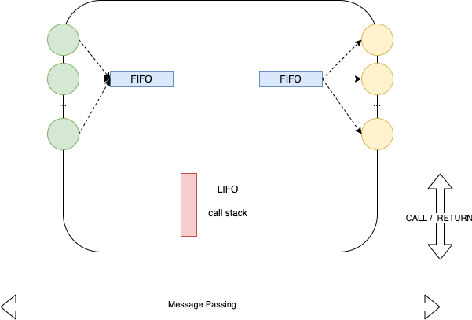
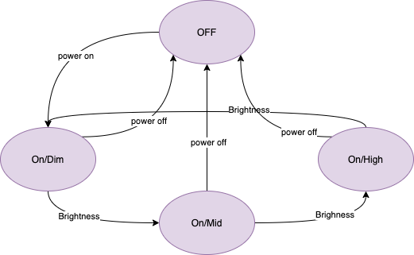
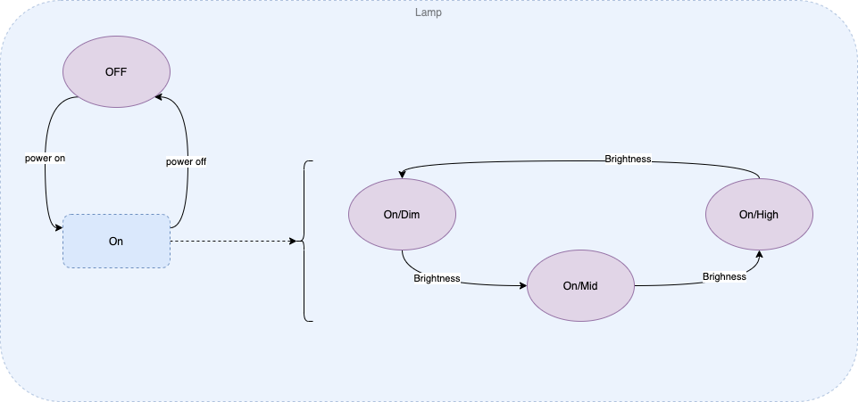
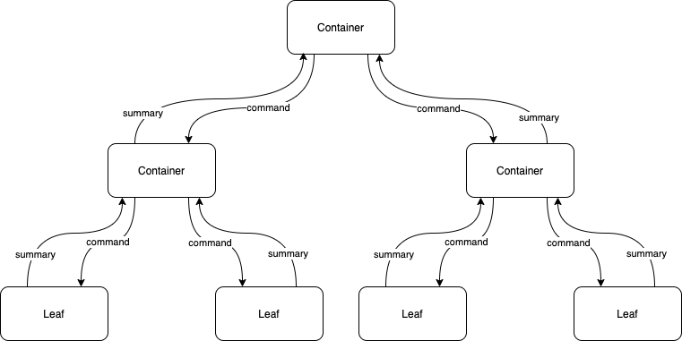

# 2022-08-09-Structured Message Passing---
copied_to_pages: "true"
---

# Message Passing
Message Passing uses FIFOs (queues), CALL/RETURN uses LIFOs (stack).

!

## The State Explosion Problem

# The State Explosion Problem
A non-hierarchical, "flat", design results in too much non-elided detail.

Example: imagine a simple table lamp with 2 push-buttons 
1. power on/off
2. brightness dim/medium/high

## Example
### Lamp
!

### State Explosion

!

The *state explosion* problem becomes more severe in more complicated software architectures.

### Layering - HSM - Hierarchical State Machine

!

Originally suggested by Harel in StateCharts paper.

Concurrency is moved to a separate notation. "Concurrency" is called "orthogonal states" in StateChart notation.

# Structured Message Passing
!

Message passing is structured in a layered/hierarchical manner.

Messages can only go "down" or "up".  

Messages cannot be sent "sideways".  Components cannot send messages to other peers.  Components can only *leave* messages on their own output queues.  Components' *containers* (managers) route messages to other child Components.

Messages can be routed to 0, 1, or more Components.

Failure mode: message passing that relies on a non-hierarchical structure fails due to the *state explosion problem*.  Message passing in a network arranged in a flat manner will fail to scale.

Optimizations flatten hierarchical structure for the sake of *efficiency*, hence, optimizations impede hierarchical structuring and must be used with care.  For example, the Architect constructs and debugs the Design in a hierarchical manner, then, Production Engineers flatten parts of the hierarchy for the sake of optimization, and, must check / test for conformance to the original design semantics.

This is the same structure used in successful business organizations.  Sending commands to Components down and around intervening managers is called "micro-management".  Sending information (summaries) up and around intervening managers is called "going over the boss's head".

All Components are constructed in a 0D - zero dependency - manner.  0D Components cannot hard-wire the names of other Components into their code.  All message-routing decisions are left to the parents (Containers) of Components.

# Slides
---

# Message Passing
Message Passing uses FIFOs (queues), CALL/RETURN uses LIFOs (stack).

!

---

## Structured Message Passing
!

---

## Layers

Message passing is structured in a layered/hierarchical manner.

---

## Vertical Messages Only

Messages can only go "down" or "up".  

Messages cannot be sent "sideways".  

Messages can be routed to 0, 1, or more Components.

---
## Failed Message Passing

- State Explosion Problem
- Lack of Layers - "flat" design.
- 
Failure mode: message passing that relies on a non-hierarchical structure fails due to the *state explosion problem*.  Message passing in a network arranged in a flat manner will fail to scale.

Optimizations flatten hierarchical structure for the sake of *efficiency*, hence, optimizations impede hierarchical structuring and must be used with care.  For example, the Architect constructs and debugs the Design in a hierarchical manner, then, Production Engineers flatten parts of the hierarchy for the sake of optimization, and, must check / test for conformance to the original design semantics.

This is the same structure used in successful business organizations.  Sending commands to Components down and around intervening managers is called "micro-management".  Sending information (summaries) up and around intervening managers is called "going over the boss's head".

All Components are constructed in a 0D - zero dependency - manner.  0D Components cannot hard-wire the names of other Components into their code.  All message-routing decisions are left to the parents (Containers) of Components.

