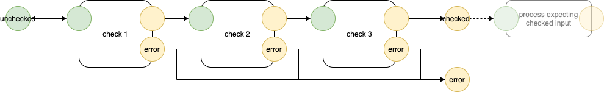

# 2022-08-14-0D Today1. No Name Calling 
## 2022-07-11-No Name Calling

# Solutions: No Name Calling
- Prohibit naming of callees.

Suggestion: Use message-passing FIFOs and let a Container wrapper route the messages.

Python: instead of `f(x)`, use

```
self.send (..., outputPort, data, ...)
```

suggestion: 
- outputPort is a string
- data is any Python datum
- just Send the message, let the Receiver check the validity of the input (type, design rules, etc.)


### 2022-07-11-Type Stacks

# Type Stacks
- progressive type checking
- pipeline of type checkers
- input to pipeline is general and loosey-goosey
- output of pipeline is specific and checked
- each stage in the pipeline checks 1 kind of detail and passes the data on, or, sends an Error message
- compose type checker chain using smaller blocks
- no need to *abort*, just don't send data on to the next stage in case of error


!
2. Structured Message Passing
3. FIFOs, not stacks (LIFOs)