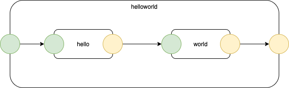
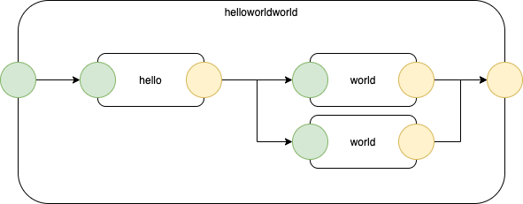

# 2022-08-21-Eh Short Description# ė - Goal and Overview

The goal of this project is to program computers using pluggable units of software.

To do this we need:
- micro-concurrency
- 0D
- layers, relative sofware units
- multiple languages.

## Hello World 
Very simple example
## Leaf
!

## Container
! 

## Re-Architecting
!
## Scalability
Pluggability is necessary for scalability, but, more elaborate (complicated) examples would be needed.

# Benefits
- anti-bloatware
- technical drawings come "for free"
- concurrency comes "for free"
- "build and forget" development
- distributed programming comes "for free"
- multiple-CPU paradigm
- ability to plug together software components to create mimimal set of functionality

further discussion...
## Eh - Benefits

# Benfits of ė
- anti-bloatware
	- a major source of bloat is special-case code needed to handle out-of-sweet-spot use-cases
		- for example, FP works well if mutation is prohibited
			- mutation added to any programming language that uses functions results in epicycles
				- "epicycle" ≣ "workaround"
				- e.g. "thread safety"
				- e.g. heaps and "garbage collection" for heaps
				- e.g. Mars Pathfinder disaster ("priority inversion")
- technical drawings come "for free"
- concurrency comes "for free"
- "build and forget" development
	- adding new software cannot change existing software
		- not true with state-of-the-art libraries
			- changing something "here" might cause something "over there" to operate differently
- distributed programming comes "for free"
	- blockchain
	- internet
	- robotics
	- games using [NPCs](https://en.wikipedia.org/wiki/Non-player_character)
- multiple-CPU paradigm
	- existing techniques are based on a single-CPU paradigm, prevalent in 1950's thinking
- ability to plug together software components to create mimimal set of functionality
	- no need for all-in-one operating systems

# Key Insights
- 0D - No Dependencies 
- FIFOs and LIFOs
- Pipelines
- Structured Message Passing
- "First Principles Thinking"
- Closures