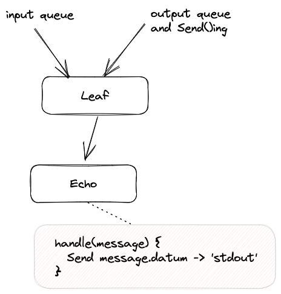
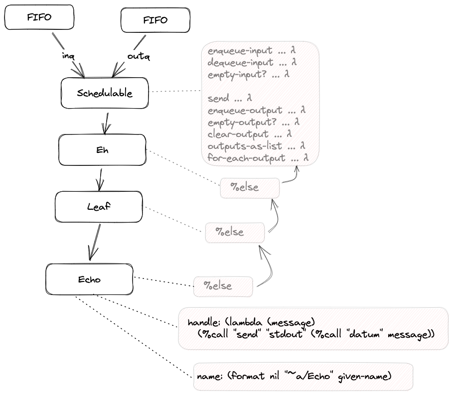

# 2023-03-12-Echo - A Simple Leaf Component# Echo - A Simple Leaf Component
## Intention

## Implementation

This implementation description is based on CL0D - 0D in Common Lisp.
https://github.com/guitarvydas/cl0d
