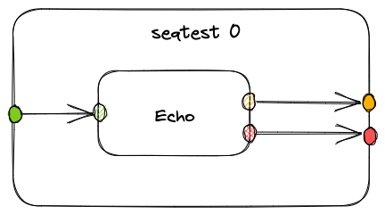
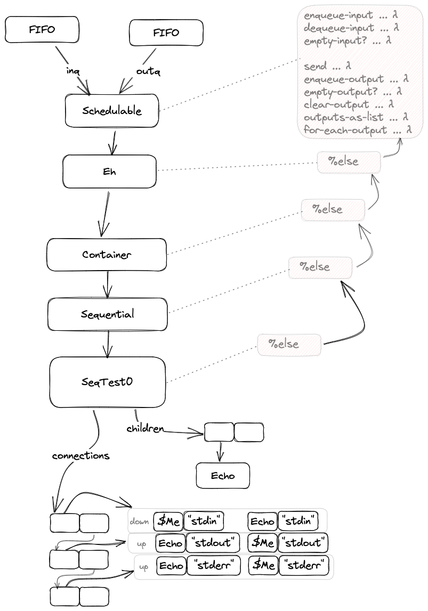

# 2023-03-12-SeqTest0 A Simple Container Component# A Simple Container Component (SeqTest0)
## Intention

## Implementation

This description of implementation is based on CL0D:
https://github.com/guitarvydas/cl0d

The repo also contains documentation for every file.