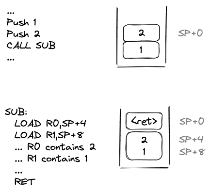
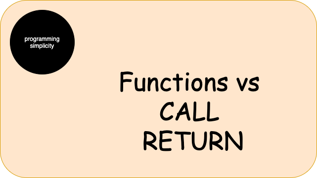

# 2023-04-13-Functions-vs-CALL-RETURN# Functions vs CALL RETURN

We have created many accidental problems by mis-using CALL and RETURN instructions to implement *functions*.

I explore the issue and point to some ways that might help in backing out of this corner.

---

## CALL RETURN Wasn't Meant to Support Functions

CALL and RETURN instructions were originally included in CPU architectures to provide code sharing.  

To make code smaller.


### A Simple Example 

Writing the same code more than once...

```
LOAD R0,VAR_X
ADD R0,1
LOAD R0,VAR_X
ADD R0,1
```

... might be rewritten so that the code is written only once and then `CALL`ed...

```
SUB: 
  LOAD R0,VAR_X
  ADD R0,1
  RET

CALL SUB
CALL SUB
```

---

## Functions in Mathematics

Functions in mathematical notation mean something else.  In mathematics, functions run instantaneously.  This is not true of CALL/RETURN code on CPUs.

---

## DRY

A central tennet of "Computer Science" is the revelation that one must use the principle of DRY - Don't Repeat Yourself.

Instead of building DRY into our IDEs, we (the royal we), took the lazy way out and mis-used `CALL` to implement DRY.  As it stands, programmers are responsible for *manually* rearranging code in the form of DRY terms, instead of letting the machine do that work for us.

---

## Why Does It Matter?
The difference between pure functional notation and `CALL` has caused many forms of self-imposed Accidental Complexity over the decades. For example the ad-hoc, muddy thinking about multitasking (semaphores, priorities, etc.).  For example the mis-belief that destructured data is the same as multiple function parameters.  For example, that the dimension of Time (t) can be ignored, etc.

To make matters worse, CALL/RETURN uses a built-in *shared, global variable* - the callstack.  This violates the fundamental assumptions of functional notation and requires the invention of epicycles as work-arounds. 

---

### Single Parameters That Masquerade As Multiple Parameters




The astute reader will notice that the two `LOAD` instructions simply desctructure the input parameter.  In other words, the input parameter is only a single parameter, not multiple parameters.

This observation is borne out by formalisms such Currying.

Several modern programming languages pay homage to this fact by allowing multiple value assignment and multiple value return.

This concept appears in Lisp, in the form of `DESTRUCTURING-BIND` and `VALUES`.

---

## Time Matters
Multiple parameters arrive/return at different times.  Single parameters arrive/return at the same time.

---

## CALL Is Usable By Synchronous Code Only

As it stands, `CALL` is meant for synchronous code - only.

---

## Concurrency

To build asynchronous code using `CALL`, we must invent epicycles such as *multitasking*.

Children as young as 5 years old learn to use a hard realtime notation[^music].  

Concurrency is simple, but, when we try to express concurrency in terms of anti-concurrency (synchrony), we need to invent epicycles, which leads to bloatware.

[^music]: Music notation.  Piano lessons.  Metronomes.  Hard realtime.

---

## The Implication
We've been using a function-based notation to express *programs*.

CALL does not map cleanly onto function-based thinking and a function-based notation.

Hence, we've gone deeply down ratholes to invent *epicycles* to work around this notational mistmatch.

It is *difficult* (unfortunately though, not impossible) to build asynchronous programs - such as internet, robotics, IoT, blockchain, etc. - using synchronous notations based on *functions*.

---

## Most Popular Programming Languages Use Functions That Are Based On CALL

Most programming languages, like Python, Rust, C, etc. use *functions*. They tend to implement *functions* using `CALL` and `RET`.  

This automatically makes the code synchronous which quietly uses a shared global variable, all of which makes concurrent programming seem more difficult than need be. In general we need to restort to assembler-level programming, using thread libraries, to express concurrency.

---

## Relational Programming

Relational programming languages, like PROLOG, miniKanren, etc. tend to separate specification from implementation.

Such languages do not contain *functions*.

The implementation of *relations*, hence, is not biased towards the mis-use of `CALL`.

---

## Shell Scripts and Processes and 0D

Another way to break free of `CALL` bias is the idea of building *processes* that do not depend on one another. I call this *zero dependency* - 0D.  Maybe I should call it XD (eXtreme decoupling)?

This technique discourages the use of `CALL` as an inter-process mechanism.

---
## Distributed Computing

Distributed computing is the same as the concept of *processes*, on steroids.  See above.

---
### Loop, Recursion
Note that language features like *loop* and *recursion* are meaningless in a distributed context.

---
### Thread Safety
Note that *thread safety* is a meaningless concept in a distributed context.

Programs on different CPUs are, well, on different CPUs.  They are naturally isolated from one another.  The concept of *thread safety* doesn't even need to come up in polite conversation.

In 1950, CPUs were very expensive and it made sense to time-share them.  Today, though we can have candy bowls filled with CPUs.  The ground rules have changed since 1950, but, the "we've always done it this way" mind-virus causes us to use 1950s biases when building programs 50++ years later, in 2023.

---
### Faking Asynchronocity
We *can* put these synchronous concepts back into our expression of distributed computing, but, it requires make-work and the invention of epicycles.

---
## Video
https://youtu.be/J8OmhhTlh6k
---
## Thumbnail
