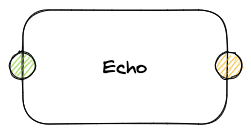
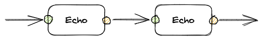
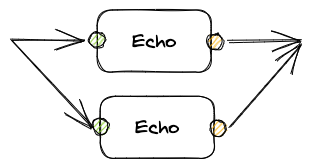
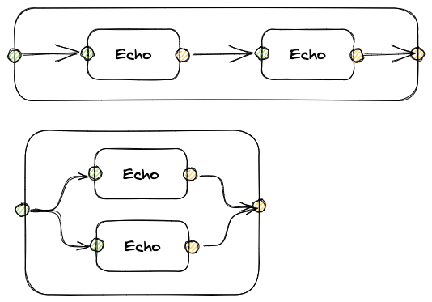
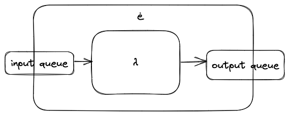
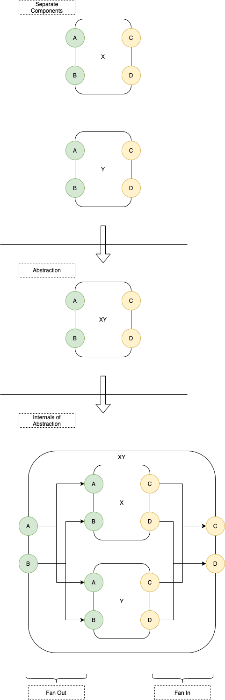
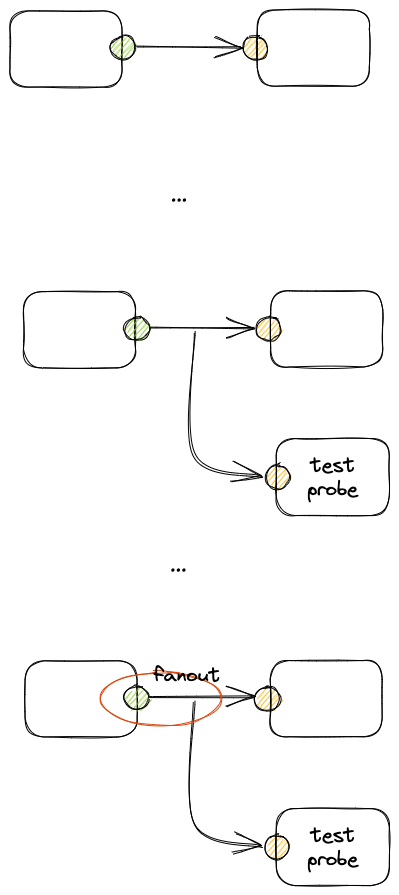
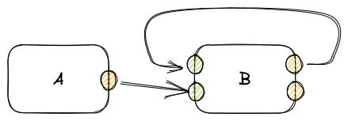
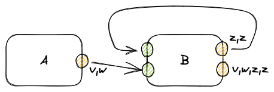

# 2023-04-15-Obsolete-Visualizing Software# Visualizing Software - ė and 0D
The goal of this project is to visualize software components written in the Odin language and to snap components together like LEGO blocks to form software systems.

We don't visualize *every* piece of Odin code, but concentrate on the bare essentials for visualizing and LEGO-ifying code.

We use draw.io to draw diagrams of software systems.

The code in this project interprets diagrams and runs them as apps.

The 0D concepts can be - easily - extended to code written in other languages.  See the section named "See Also".

There are two main aspects to visualizing software units:
1. Creating a 0D library that allows programmers to write decoupled software units
2. Creating an interpreter that runs diagrams.

Compiler technology is just a subset of interpreter technology.

Item (1) - creating a 0D library - is more important than (2).  Creating an interpreter and a compiler is just straight-foward *work*.

0D makes it possible to imagine boiler-plate pieces of code.  Compiling boils down to finding and exploiting boilerplates.  

In this project, we demonstrate the aspects of 0D and of intrepreting diagrams.  The concept of compiling diagrams follows from the interpreter, with 0D as the runtime system, akin to crt0 in C compilers.


## Basic Concepts Simplified

A *function* is a blob of code.  

Here is a simple example of a function - Echo - that simply returns whatever it receives as input.

```
echo := ...,
      proc(..., message: Message(string)) {
	      send(..., "stdout", message.datum)
	    },
```

The `...` stuff is technical detail that we wish to ignore for now.

Basically, Echo is a `proc` that receives a Message.  As a reaction, the `proc` extracts the data from the Message and sends it back out.  

In this code, Echo uses the `send` function instead of using `return` to return a value.

To make *functions* into *software components*, we simply add input ports and output ports, e.g.

!


This basic example is so simple that we need only one input port and only one output port.  In general, though *software components* can have 0, 1, 2, 3, 4, ... input ports and 0, 1, 2, 3, 4, ... output ports.

*Software Components* are completely independent from on another and can be scheduled in any way.  We use arrows to reprsent messages flowing between components.

### Sequential Arrangement


!


### Parallel Arrangement

!


### Container Components
In the diagrams above, the input arrows seem to come from nowhere and the output arrows seem to go nowhere.

We simply need to wrap the above diagrams in another component.

!


We call these kind of *wrapper* components, *Container* components.

Components that aren't *wrappers* are called *Leaf* components. 

### How Do You Write This In Odin?
We wrote Odin procedures for the above diagrams.  

```
package zd

import "core:fmt"
import "core:slice"

main :: proc() {
    fmt.println("--- Handmade Visibility Jam")
    fmt.println("--- Sequential")
    {
        echo_handler :: proc(eh: ^Eh(string), message: Message(string)) {
            send(eh, "stdout", message.datum)
        }

        echo0 := make_leaf("10", echo_handler)
        echo1 := make_leaf("11", echo_handler)

        top := make_container("Top", string)

        top.children = {
            echo0,
            echo1,
        }

        top.connections = {
            {.Down,   {nil, "stdin"},              {&top.children[0].input, "stdin"}},
            {.Across, {top.children[0], "stdout"}, {&top.children[1].input, "stdin"}},
            {.Up,     {top.children[1], "stdout"}, {&top.output, "stdout"}},
        }

        top.handler(top, {"stdin", "hello"})
        fmt.println(eh_output_list(top))
    }
    fmt.println("--- Parallel")
    {
        echo_handler :: proc(eh: ^Eh(string), message: Message(string)) {
            send(eh, "stdout", message.datum)
        }

        top := make_container("Top", string)

        top.children = {
            make_leaf("20", echo_handler),
            make_leaf("21", echo_handler),
        }

        top.connections = {
            {.Down, {nil, "stdin"},              {&top.children[0].input, "stdin"}},
            {.Down, {nil, "stdin"},              {&top.children[1].input, "stdin"}},
            {.Up,   {top.children[0], "stdout"}, {&top.output, "stdout"}},
            {.Up,   {top.children[1], "stdout"}, {&top.output, "stdout"}},
        }

        top.handler(top, {"stdin", "hello"})
        fmt.println(eh_output_list(top))
    }
}
```

```
$ make runbasic 
./demo_basics.bin
*** Handmade Visibility Jam ***
--- Sequential
[{stdout, hello}]
--- Parallel
[{stdout, hello}, {stdout, hello}]
$ 
```

all of the code is in https://github.com/guitarvydas/odin0d

N.B. The `.up`/`.down`/`.across` stuff is the way we describe how diagram arrows connect to Components.  We enable the concept of *layering* and *nesting*, which means that we needed to dissect - in detail - how data is routed in 4 combinations (out->in, in->in, out->out, container-level-in->container-level-out).  Describing arrows this way mimics what we intuitively see on diagrams.

### Code Grind-Through

Let's begin with the sequential version...

```
package demo_basics

import "core:fmt"
import "core:slice"
import "core:strings"
import "core:encoding/xml"
import "core:os"

import dg "../diagram"
import zd "../0d"

Eh             :: zd.Eh
Message        :: zd.Message
make_container :: zd.make_container
make_leaf      :: zd.make_leaf
send           :: zd.send
output_list    :: zd.output_list

main :: proc() {
    fmt.println("*** Handmade Visibility Jam ***"
    fmt.println("--- Sequential")
    {
        echo_handler :: proc(eh: ^Eh, message: Message(string)) {
            send(eh, "stdout", message.datum)
        }

        echo0 := make_leaf("10", echo_handler)
        echo1 := make_leaf("11", echo_handler)

        top := make_container("Top")

        top.children = {
            echo0,
            echo1,
        }

        top.connections = {
            {.Down,   {nil, "stdin"},              {&top.children[0].input, "stdin"}},
            {.Across, {top.children[0], "stdout"}, {&top.children[1].input, "stdin"}},
            {.Up,     {top.children[1], "stdout"}, {&top.output, "stdout"}},
        }

        top.handler(top, {"stdin", "hello"})
        print_output_list(output_list(top))
    }
    ...
}
```

In our opinion, the program - written out as ASCII Odin textual source code - ain't as readable as the diagram.

The first few lines - `package`, `imports` and `::` stuff - is a bunch of details required to appease the Odin compiler and to write code in a non-layered manner[^fl].

[^fl]: Or, if you wish, fake layering using text instead of rectangles.

Then, we see some lines of code that declare the `main` procedure and print out a banner. (`main :: ...`, `fmt. ...`, `fmt. ...`)

Then we see ASCII `{ ... }`, meaning "box".

What is seen inside the box, is the text code required to build a Container called "top" which contains two Leaf components, both almost the same.  The two Leaf components have slightly different names - "10" and "11" - which are actually redundant, since the Leaf's unique identities can be determined by their coordinates (X and Y ; and if you're really ambitious, x/y/z/t).  Names are there only to appease human readers during bootstrap.  The machine doesn't care whether the names are readable or not.  In the end, names will not be needed.

The lines 
```
        echo0 := make_leaf("10", echo_handler)
        echo1 := make_leaf("11", echo_handler)
```
create two children Leaf Components by specifiying a handler proc to be used.  In this case, we can use the same proc twice, since we want each Leaf to do exactly the same thing.

The lines:
```
	top := make_container("Top", string)

    top.children = {
...
    top.connections = {
...
```
create the Container called "top" and supply 3 pieces of information
1. the boilerplate code `make_container(...)`
2. a list of the children within the Container
3. a routing map between the children and/or the Container.

Each connection is described by 3 details:
2. from (a Component)
3. to (a Component)
1. path (.Down, .Up, .Across)

We call the routing map "connections".

Then, we send a message to the `top` component on its port "stdin".  The message is the string "hello".

When the `top` component finishes running, we execute one more line of code.
```
print_output_list(output_list(top))
```
This line of code retrieves the output messages from `top` and prints them on the console.

We can run this example in the following way:
```
$ make runbasic 
./demo_basics.bin
*** Handmade Visibility Jam ***
--- Sequential
[{stdout, hello}]
--- Parallel
[{stdout, hello}, {stdout, hello}]
$
```

Note that runbasic runs both, the sequential and parallel versions of the program.

### Parallelism
The parallel  version of this system is almost the same, except for rewiring.  

The routing table is different.  It connects top's "stdin" to the "stdin" of its two children.  It connects the "stdout" port of both children to top's only output "stdout".

```
{.Down, {nil, "stdin"},              {&top.children[0].input, "stdin"}},
{.Down, {nil, "stdin"},              {&top.children[1].input, "stdin"}},
{.Up,   {top.children[0], "stdout"}, {&top.output, "stdout"}},
{.Up,   {top.children[1], "stdout"}, {&top.output, "stdout"}},
```

### Meaning of Connections
#### Down
```
{.Down,   {nil, "stdin"},              {&top.children[0].input, "stdin"}},
```
A *down* connection is used by a Container to punt messages to its children.

In this example, any message that arrives on "top"s "stdin" input will be punted to the "stdin" input of the 0th child Echo.

#### Across
```
{.Across, {top.children[0], "stdout"}, {&top.children[1].input, "stdin"}},
```
An *across* connection is used to send messages from one child to another.

In this example, the 0th child's output messages on "stdout" are routed to the 1th child's "stdin" input.

Note that no child is allowed to control *where* the messages go.  Routing decisions are made *only* by their parent containers.

#### Up
```
{.Up,     {top.children[1], "stdout"}, {&top.output, "stdout"}},
```
An *up* connection is used to send messages from one child to the output of its parent container.

In this example, output from the 1th child's "stdout" port is deposited on top's "stdout" output port.

## How Do We Write This Program In Draw.IO?
We use ellipses for ports, rectangles for components, rhombuses for container ports and arrows for connections.

We don't bother to label connections with their path information.  That information is "obvious" from the diagram.

A limitation of draw.io is that it can't drill-down into Container components.  Ideally, double-clicking on a Container should bring up another diagram, while double-clicking on a Leaf should bring up a code editor.

We make do with draw.io's limitations.  To view the insides of a Container, you must select a tab at the bottom of the draw.io editor.  To view the insides of a Leaf, you have to open your favourite text editor on the Odin code that implements the Leaf.  Draw.io doesn't make it easy to arrange Containers in some sort of hierarchy.

### Sequential Program Written In Draw.IO

!

### Parallel Program Written in Draw.IO

!


## Full-Blown App
We will use the above techniques to write the beginnings of a Visual Shell for Linux.

Background: Decades ago, one of the authors created a demo called *vsh* (Visual SHell) using a mish-mash of technologies including the `yEd` diagram editor, `PROLOG` and `C`.  The Visual Shell was conquer-and-divided into 2 parts:
1. diagram compiler
2. assembler - to convert compiler output to Linux system calls.

Due to the time limitations, we'll spiral in from the top-down, to re-implement this app.  We'll stop when we run out of time.  Maybe we'll continue to finish this code after the Jam.


# Appendices
### The Through Connection

This example does not show a 4th kind of connection - *through*.  This kind of connection is used to send a message from the input of a container directly to its own output.

## ė
An ė (pronounced *eh* in ASCII) component is like a *lambda* that has one input queue and one output queue.

!


## 0D
0D - Zero Dependency - in a nutshell is total decoupling.


## 2022-11-28-0D Q and A

# What does 0D mean? 

 0D means zero dependencies. What I'm talking about is not app level dependencies, but programming dependencies that are kind of hidden under the hood. 

# How are dependencies related to concurrency? 

It's mostly got to do with scalability.  Anything that's tightly coupled isn't very scalable.  If you do scale it, you scale it in big chunks.  Optimized code has to be scaled upwards in big pieces. 

When we put concurrency under a microscope, we see two aspects of concurrency emerge. 

One aspect is 0D -  decoupling. Decoupling is the nucleus of concurrency. 

And the other aspect is simultaneity. Which means we can arrange things to be parallel, simultaneous, sequential. Whatever we want. 

# How do current text languages tend to force us to insert unwanted dependencies? 

I count at least three different things. 

The first is the normal function call. Most often you hardwire the name of the function into the caller. That's a dependency. The caller needs to know that a function with a given name exists. 

The second type of thing that happens is that a function call results in blocking. The caller blocks until the callee returns a value. This kind of blocking interferes with the operating system's idea that it controls blocking. 

The third kind of unwanted dependency is "return from a function". 

Most languages define functions that return values to the callers. This is a hardwired routing decision and conflicts with the type of thing we want to do with IoT and internet and et cetera, where we have clients and servers. A single server might have multiple clients requesting information and that server sends information back to each of the clients. So it has multiple outputs. 
# How does concurrency give us referential transparency? 

Referential transparency is known in hardware as a chip being pin compatible with another chip. The main aspect of referential transparency is the ability to replace one component with another component. 

There's a prerequisite for referential transparency.  We have to snip all dependencies. Functional programming: when they talk about referential transparency, they actually do snip all of the dependencies and they pass them in as parameters. 

# How can we compare concurrency and functional programming?  
There's nothing new here. It is possible to express and use concurrency in many different programming languages. 

The trick is to find a convenient notation that makes concurrency look easy and makes concurrency easy to manipulate and easy to think about. 

If we look at FBP, it uses boxes to represent concurrent components and it uses arrows and lines to represent data flowing between components. 

StateCharts is another visual notation. StateCharts uses sets of ellipses to represent state machines. And StateCharts uses diagram nesting to represent layering and is the way that StateCharts reduces the state explosion problem. 

Functional programming uses Lambda for nesting and for the reduction of state explosion. On the other hand, functional programming causes more state explosion by insisting on explicit types.  That I think leads to bloatware. 

The C language brought in the idea of using ASCII braces for nesting and for blocks associated with functions.  C uses functions themselves  to reduce the state explosion problem.  Many other languages use functions to reduce the state explosion problem.

# Resources
Other things that you might want to look at when considering concurrency is the talk by Rob Pike "Concurrency Is Not Parallelism". There's a book called "Event Based Programming, Taking Events to the Limit". It uses C-sharp but chapter one in that book contains a good, long discussion of coupling and the evils of coupling. 

And then there's a YouTube that I tried to make about parallelism and 0D and scheduling and that sort of stuff.  

"Concurrency is not Parallelism": https://www.youtube.com/watch?v=oV9rvDllKEg

"Event-Based Programming": https://www.amazon.ca/Event-Based-Programming-Taking-Events-Limit/dp/1590596439

"Parallelism": https://youtu.be/JD8QpV-t5eM

Kinopio notes: https://kinopio.club/0d-q-a-SivbkkUtzbnxU6tUnqb7x

## 2023-01-24-0D Ideal vs. Reality

- ideal: use both, function calls and 0D (Send ()), without letting language influence your thinking
- ideal: use both, but, remain aware of what each choice accomplishes
- ideal: 0D to be so cheap that it could be used on every line of code

- reality: 0D is entangled with Multiprocessing and the current grain size is "Process"
- alternate reality: 0D can be couched in terms of closures and FIFOs, hence, grain size is "function" (where closure is roughly equivalent to function)

- reality: CALL/RETURN and the callstack are hard-wired into CPUs (there used to be a time when CPUs didn't have hard-wired callstacks)

- reality: 1950s IDEs for Programming were Programming Languages, but, in 2022++ IDEs include other stuff, like powerful programming editors

CALL is used for 2 reasons: (1) compacting code size, (2) DRY (Don't Repeat Yourself).  There is no good reason to allow CALL/RETURN to leak into end-user code except for case (1) compacting code size [corollary: case (2) should be entirely optimized away at "compile time" and "edit time"] 

x.f(x) is syntax with the meaning "mutate the global callstack and mutate the IP to point at the method function x.f" (and "return" means "put the return value in a special place, then mutate the global callstack, then mutate the IP to point at the caller's continuation code")

but, there is no popular builtin syntax for Send()ing to an output queue and passing the finalized output queue back up to the parent Container

## 2022-08-30-Decoupling

# The Fundamental Problem
All programming languages and all operating systems have one (1) thing in common:
- over-use of synchronization.

Programmers have built towers of epicycles to work around this fundamental issue.

Once understood, it is easy to overcome this commonality.

# Discussion
For example, programmers need to employ elaborate schemes to decouple applications built with implicitly-synchronous languages - like Haskell, C++, Python, etc.

One such elaborate scheme is the invention of *operating systems*.  Operating systems employ the brute-force technique of *preemption* to yank control away from overly-synchronous applications.

Applications, that use the very common technique of function-calling, actually employ *ad-hoc* blocking.

> [!information] Functions perform ad-hoc blocking
> Functions - even in FP (functional programming) languages - are State Machines that mutate a global variable.  At their most basic, functions contain 2 states: (1) pre-call, and, (2) post-return.  When a function calls another function, the caller *blocks* waiting for the callee to return a value.  Since function calls can be inserted into code at any point, they represent ad-hoc *blocks* that take away control-of-blocking from the Operating System. 

> [!information] Functions mutate a global variable
> The call-stack is a shared piece of memory, a "global variable" supported by hardware (using the CALL and RETURN instructions).  All routines in a single CPU share the same call-stack.  The call-stack is used for bookmarking return-points ("continuations").  The call-stack is essentially a dynamically scoped list of bookmarks (space-optimized to be an array).
> Early CPUs did not have a call-stack.  The call-stack was added later.

> [!information] Functions inhibit routing
> In the function-call paradigm, data / message routing is reduced to a single choice - the data is *always* routed back to the caller.  Any other kind of routing strategy is reduced to second-class status and given the derisive name *side-effect*.


What systems should not be strongly coupled?

What systems should be strongly coupled?
- operating system processes -> concurrency -> decoupling
- preemption
- thread safety
- libraries vs. testing
- loops
- internet, IoT, Robotics, NPCs, Blockchain
- concurrency
	- decouple
	- libraries of functionality
- bookmark mutates callstack
- function call overrides blocking control and takes it away from O/S
- text-based programming languages
	- due to 1950's hardware limitations and premature optimization
- thread safety
	- due to mutation
	- remove mutation -> Sector Lisp -> anti-bloatware

# Syntax for Decoupling
... ideas ...

Send (port, data) *- function call syntax*

snd[port, data] *- special syntax*

port << data *- special syntax, less-less-than*

port = data *- assignment-like syntax, requires checking of LHS to see if it's a variable or a port*

port ⇠ data *- unicode operator*
data ⇢ port *- unicode operator*

all of the above transpiled into a function call to Send (...)
when simulating decoupling in sync paradigm

## 2022-07-11-0D

# 0D Is Important
I continue to struggle with finding ways to say "0D is important".

0D means "zero dependency".

---

# Problem of Perception
People don't "see" that there is a difference between functions and 0D

---
# Analogy - Perspective in Art

The perception problem is akin to pre- and post-perspective Art.

People didn't "see the need" for perspective in 2D artwork until "steam engine time" 

[Paul Morrison used the phrase "Steam Engine Time"].

---

# Faster Horses
The perception problem is akin to:

> If I had asked people what they wanted, they would have said faster horses” 

attributed to Henry Ford

---
# First Use-Case For Electric Motors
The perception problem is is akin to the first use-case for electric motors.

First use-case: pump water uphill to create artificial streams that could turn paddlewheels that ran factories [Digital Darwinism](https://www.amazon.ca/Digital-Darwinism-Survival-Business-Disruption/dp/0749482281)

https://www.amazon.ca/Digital-Darwinism-Survival-Business-Disruption/dp/0749482281

---

# Epicycles
We have developed epicycles due to dependencies and workarounds that manage dependences 

Like *make*, *package managers*, *nixos*, etc.

Instead of simply removing all dependencies.

---

# Programming Should be Easy
Programming should be easy

But, modern programming using state-of-the-art languages is not easy.

---

# Tells
- Prevalent notion that "multitasking is difficult".

- Prevalent notion that "distributed programming is difficult".

- Prevalent notion that "systems programming is difficult" 
	- and, can only be expressed using low-level languages

---
# If It's Difficult, Invent a New Notation
If something looks difficult, invent a new notation to describe it.  

Create another layer to abstract-away the constructs in the current layer.

---
# Functional Programming
Functional programming is a notation for designing calculators.

# Sequencers
Multitasking, IoT, internet, music and video sequencers, robotics programs, etc. are not calculators.

The dimension of time (*t*) cannot be ignored in a notation for building sequencers.

*Modeling* a fundamental concept (like *t*) is not as good as building a notation around the concept.

---
# Example: Evolution of Software Notations
- Electronics looked difficult, so opcodes and instruction sets were invented 
	- instruction sets are, but, a notation that abstracts-away the underlying rats' nests of complicated details of electrons flowing within oxides

- Opcodes and instructions sets using binary codes looked difficult, so Assembler was invented

- Assembler looked difficult, so C was invented

- C looked difficult, so higher-level languages were invented.

- Now, programming in higher-level languages looks difficult ...

# The Difference Between *Electronics* Design and *Software* Design...
Electronics components are 0D, completely isolated from one another

Software components are rife with dependencies and built-in synchronization, N0D (non-0D)

---

# Analogy: LEGO®
Single type - round peg
	- just one type, not many types

A single type begets simplicity
	- simplicity is "the lack of nuance"

0D - no interdependencies
	- cutting one LEGO® block in half does not affect any other LEGO® block

- LEGO® blocks can be snapped together to form larger systems
- Larger systems built out of LEGO® blocks can be broken down by removing blocks
- Blocks from one system can be reused to build other systems
- Complete sub-systems can be broken away from existing systems and can be used to build other systems
---
# Software Libraries and Functions
Libraries of functions cannot be easily reused due to inter-dependencies.

Libraries of functions cannot be easily tested in a stand-alone manner, due to inter-dependencies.

---

# OOP Does Not Implement "Message Passing"
Message passing in OOP languages is implemented using N0D Call/Return

Rhetorical question: Is OOP an abstract notation, or, is OOP a technique for programming CPUs?
- methods imply the use of blocking functions (see "functional notation")

---

# Functional Notation
Functional notation is based on blocking state machines
- e.g. `f(x)` blocks the caller until the callee returns a value
	- this is a state machine, the state is recorded as bookmarks on The Call Stack

 "Blocking" thwarts the efforts of Operating Systems to control applications, and, makes Operating Systems more dificult to implement, needing more nuance and workarounds, often resulting in latent gotchas.

---

# Sector Lisp
[Sector Lisp](https://justine.lol/sectorlisp/) is an example of how small and beautiful FP notation can be if it is left alone and not overloaded with concepts that are outside of its "sweet spot".

Jart's GC is only 40 bytes [sic, not K, not M, not G, but, bytes].

Sector Lisp: https://justine.lol/sectorlisp/

---
# Functional Notation and Hardwiring Names

`f(x)` hardwires the name `f` into the callers code

Making it difficult to use the code in other situations.

---
# OOP "Encapsulation" Is Not Enough
"Encapsulation" encapsulates data

"Encapsulation" does not encapsulate control flow

---

# Control Flow And Data Flow
Control flow and data are not the same concepts

A single notation for both cannot be used without compromising one or the other.

"Data" is layout of information *in storage*

"Control flow" is layout of behaviour *in time*

---

# Schizophrenia
Previous attempts to subsume both, data and control flow, into the same notation have resulted in schizophrenic programming languages that sacrifice one or the other notion.

Popular fad today: sacrifice control flow layout, while emphasizing data layout.

---
# Structured Programming
Attempt to apply structuring concepts to control flow layout

Recommendation for structuring -> single input, single output 
	- layering
	- abstraction of control flow layout

---
# Analogy: Human Interaction, "Free Will"
Humans understand how to deal with independent units (e.g. other humans).

Hard-wiring synchronization into an underlying notation defies human intuition, giving rise to the notion that "programming is difficult" and requiring many years of schooling to learn to think in terms of over-synchronized units

---
# Diagrams
Humans understand blocks on diagrams to represent independent units

Mapping diagrams to Synchronous Programming Languages[^spl] defeats the purpose of creating diagrams

SPLs do not faithfully represent 0D diagrams.

---
# Solutions: No Name Calling


### 2022-07-11-No Name Calling

# Solutions: No Name Calling
- Prohibit naming of callees.

Suggestion: Use message-passing FIFOs and let a Container wrapper route the messages.

Python: instead of `f(x)`, use

```
self.send (..., outputPort, data, ...)
```

suggestion: 
- outputPort is a string
- data is any Python datum
- just Send the message, let the Receiver check the validity of the input (type, design rules, etc.)


#### 2022-07-11-Type Stacks

# Type Stacks
- progressive type checking
- pipeline of type checkers
- input to pipeline is general and loosey-goosey
- output of pipeline is specific and checked
- each stage in the pipeline checks 1 kind of detail and passes the data on, or, sends an Error message
- compose type checker chain using smaller blocks
- no need to *abort*, just don't send data on to the next stage in case of error


!

# Solutions: Extending Flow-Based Programming

### 2022-07-11-Extending Flow-Based Programming

# Attention to UX Instead of Mathematical Niceties
- need for abstraction
	- lasso a group of components with a total of N ports
	- replace group of components by a single component with fewer than N ports 
		- implies fan-out for implementation
		- implies single-entry & single-exit points, abstracting FIFOs (bounded queues) down to single input and single output

!

# Secret Sauce of FBP
0D

No dependencies.

Often mis-named "parallelism".

Parallel software components imply 0D.

0D components do not imply parallelism.


# Programming Languages are IDEs for programming
- PLs (IDEs) invented in mid-1900s
	- to appease hardware capabilities of the day
- based on cells of bitmaps ("characters")
- cells may not overlap
- cells are fixed-sized
	- font sizing affects many cells at the same time
- windows are not fixed-size
- rectangles on a diagram are not fixed-size
	- it is convenient to use a diagram editor to change the size of a rectangle
	- it is not convenient to use a diagram editor to change the size of a piece of text (by dragging a corner, say)


# Fan-Out
- one output feeds many inputs
- requires copying, or, copy-on-write, or, ...
- copying
	- implies memory management (GC (Garbage Collection)
- copy-on-write
	- JavaScript assignment semantics, creating *own* variables

[^spl]: "Synchronous Programming Languages" means just about every popular programming language in use today, e.g. Python, Rust, Haskel, Lisp, JavaScript, C, etc.  Relational Programming Languages are not SPLs.

## Messages
Messages are pairs:
1. port (e.g.name as a String, or an ID that it more efficient in a given context)
2. data (anything)

## How Ports Work

Each Component - Container or Leaf - has a single input queue, and, a single output queue.

Messages are enqueued on the queues, along with their port names.

Note that there is only one input queue and one output queue per component, not one queue per port.

There is no concept of *priority* for messages.  If prioritization is required, it must be explicitly programmed by the Architect/Engineer on a per-project basis.

The goal of this work to is allow the Architect/Engineer to decide, on a per-project basis, what needs to be done.  The goal is to provide a set of simple, low-level operations that can be composed by the Architect/Engineer to solve specific problems.  Generality and general-purpose programming are to be eschewed.

## Drawing Compiler
The Big Bang For The Buck is simply that of drawing diagrams.  Having a compiler which compiles diagrams to code is only a nice-to-have, but, not essential.  

In this jam, we show how to use one specific drawing editor - draw.io - to build programs as diagrams.  Other editors could be used, such as Excalidraw, Kinopio, yEd, etc.  Each existing editor has some advantages and some drawbacks.  Of these choices, Kinopio seems to embody the concepts of nesting and web-ification, but, Kinopio is not actually targeted at diagramming.  Maybe this work will inspire new ideas for DaS editing (Diagrams as Syntax).

In this project, a simple diagram interpreter was implemented in Odin.  Most diagram editors can produce JSON or XML, which makes their diagrams easily parse-able by existing text-only parsing tools.

Our favoured text-only parsing tool is, currently, Ohm-JS. 

## Scheduling
Components can be scheduled in any way desired by the Software Architect.

Projects are constructed by snapping components together, in manner similar to using LEGO blocks to construct various toy structures.
## Routing
The Big Secret in this work is the idea that there are 2 kinds of components:
1. Leaf - general purpose code that produces output messagesm instead of using `return`
2. Container -  contains children components and handles all routing between children.

Children cannot refer to other components.  No Name Calling.  This simple rule enhances flexibility. 


## 2023-04-08-The Benefits of True Decoupling

# The Benefits of True Decoupling
- probes
- incremental compilation
- reshuffle architecture
- LEGO-like software blocks
- unit testing
- incremental type checking
- syntactic composition
- nested packaging

## Unit Testing
Unit testing without dependencies is possible.  But, existing unit testing frameworks drag in other software due to dependencies.  0D decoupling reduces dependencies and makes unit testing leaner and more focussed on the unit under test.

## Syntactic Composition - Macros vs Hygienic Macros vs User-Friendliness
Syntactic composition is the same as phased compilation, and, macros.  

The whole issue of "hygienic macros" is the creation of macros without using phases[^swoop]. The advantage of hygienic macros is rigor without respect for UX issues. The drawback of hygienic macros is that they are not very user-friendly, aka "too complicated" for normal use. 

[^swoop]: One fell swoop technique ≡ crush all phases into a single phase, disregarding accidental complexity that is caused by doing things this way.  Accidental complexity is fixed using the application of ad-hoc, epicyclic band-aids.

Phased compilation produces hygiene, and, chops compilation up into smaller bits, i.e. phased compilation is *divide and conquer*.

### Why Hasn't Phased Compilation Been Used Until Now?

Historically, building syntax has been considered to be difficult, thanks to CFGs.

Up until now, building more than one syntax phase has been considered to be too much work.

Now, though, PEG parsing has re-opened the door on what can be done syntactically, easily.  In my view, Ohm-JS is the most advanced form of PEG parsing.

It is - now - possible to build many little syntax-based phases.  We don't do this at the moment, because of the "we've always done it this way" mind-virus.  CFGs address the concerns of the 1950s.  PEGs allow us to mollify 1950s-based concerns.

## Insidious, Hidden Coupling
- call-return
- hard-coded routing
- hard-coded removal of *t* dimension (*time*)
- hard-coded name-calling
- 1 in, 1 out

## True Decoupling (0D)

!


0D is laugingly easy, especially with closures and queues.

Examples of 0D are:
- CL0D - Common Lisp - Alists and Lambdas (no need for *self* nor *classes*) - https://github.com/guitarvydas/cl0d
- PY0D - Python3 - https://github.com/guitarvydas/py0d
- Odin0D - Odin - https://github.com/z64/odin0d

0D decoupling defines two APIs for each software unit
1. the input API
2. the output API.
Software components cannot call other software components.  Software components *must* use their own output API, instead.

Probes need fan-out.  Forbidding fan-out due to academic reasons discourages use of the probing technique.
!


In electronics, probes suck a tiny bit of current away from the circuit being probed.  Electronics probes are "high impedance" and tend not to interfere with circuits under test.  Oscilloscopes and ohm-meters are electronic probes, but, lower-cost, stand-alone probes exist, too.

In software, fan-out requires data copying and atomicity[^ad].  All easy to do.

[^ad]: Atomicity is required for message delivery.  Only.  Atomicity is not required for other operations.

Processes in operating systems rely on true decoupling.  The operating system is free to schedule execution of software components in various ways.  True decoupling (0D) can be done much more efficiently than by using processes.  There is nothing new here.  Making processes cheaper ("more efficient"), though, encourages their use in subtle, new ways.

The main feature of operating systems is that operating systems isolate - using hardware assist - adversarial processes and address spaces from one another.  A drawback is that such isolation requires sledge-hammer techniques like preemption.

Preemption is *not* necessary for multitasking within a single software app, where *bugs* are just *bugs*.  Much less hardware-assist is needed in such cases, reducing cost and running time.  Contrary to popular belief, multitasking *can* be done using cooperative multitasking techniques.  Loops and deep recursion must be forbidden in such systems. Long running loops and deep recursion are simply considered to be *bugs* that need to be repaired.  Internet-y problems make Loops and Recursion unusable, anyway[^loops].

[^loops]: Loops and deep recursion can be used to describe the innards of single nodes in distributed systems, but are useless for describing the distributed systems themselves. Current popular programming languages are, at best, assembly languages for the expression of distributed systems.
## Feedback
An interesting outcome of this technique is the use of feedback (which is not the same as recursion).


## 2023-04-02-Feedback

# Feedback

Feedback is not recursion.  Recursion uses LIFOs, feedback uses FIFOs.  A feedback "call" in recursion jumps to the front of the queue, whereas a feedback "message" goes to the end of the queue.  "Calls" are processed immediately, whereas "messages" are processed later, in order of arrival.

A simplisitic test of feedback is to have 2 components, A and B.  A sends messages *v* then *w* (in that order).  B has 2 input pins, one for raw data and one for feedback data.  B has two output pins - (1) an output and (2) a feedback pin.  B follows the algorithm:
- when a message arrives on the raw input, B sends 2 messages - the raw data is sent on the the output, AND, a *z* is sent on the feedback output pin
- when a message arrives on the feedback input, B sends only 1 message - the incoming data is sent to the output, but, nothing is sent to the feedback pin.

In the system shown below, we would expect to see output *v*, *w*, *z*, *z*.

---


!


---

!


---


### Why Not Use an IF-THEN-ELSE on the Raw Input?

It is *possible* to use an if-then-else statement on the raw input *v*, *w*, instead of using two pins.

Using two in put pins, though, allows the engine to perform the conditional statement in any way that it pleases, and, makes the design more visual. 

In FP, this kind of thing is called "pattern matching".  Instead of using complicated patterns, we restrict patterns to be simple *tags*.  This allows us to easily draw diagrams. 

Q: What happens if you need to deal with complex patterns? A: Break the complex patterns down into simpler tag-driven problems in a pipeline instead of handling everything in one fell swoop.

## Why is Feedback Important?
The most obvious use-case for feedback is to implement a distributed *for* loop.

Languages that have *for* built into them constrain the way we are allowed to think about distributed problems.

One of the tennets of FP style - in fact, Denotational Semantics style - of programming, is to *make everything explicit*.  FP fails this simple goal, in that it hides the use of the call-stack (a LIFO).  

Using *explicit* drawings allows software architects to create solutions using many more degrees of freedom.  In many cases, too much explicitness becomes a burden, is visually "too busy" and breaks the Rule of 7[^ruleof7]  In such cases, *syntax* comes to the rescue.  One can wrap *skins* around solutions to make the appearance of the solution more pallatable.

At this moment, most of our syntaxing tools - like Ohm-JS - are targeted at creating skins for textual representations of programs.  On the other hand, most of our current diagram-editing tools, like Excalidraw and draw.io and SVG, can create textual representations of diagrams, so, we can use existing text-biased syntaxing tools while waiting for better diagram-biased syntaxing tools to appear (diagram macros, diagram parsers, etc.)

[^ruleof7]: Rule of 7: All details are chopped up into layers.  No node in a layer has more than 7±2 items in it.  Most programming languages encourage breaking this rule, i.e. they encourage writing functions that have more than 7±2 lines of code in them, they encourage writing program modules that have more than 7±2 functions in them, they encourage the use of more than 7±2 types, etc, etc.

Feedback is used heavily in electronics designs, in ways that haven't permeated software development culture.  For example, in *op-amp* designs, negative feedback is used by ICs to self-regulate.

# Code
[see the repo](https://github.com/guitarvydas/py0d)
## Program Using Components and Messaging
```
class A(Leaf):
    def handle(self, message):
        self.send(port='stdout',datum='v')
        self.send(port='stdout',datum='w')

class B(Leaf):
    def handle(self, message):
        if (message.port == 'stdin'):
            self.send(port='stdout',datum=message.datum)
            self.send(port='feedback',datum='z')
        elif (message.port == 'fback'):
            self.send(port='stdout',datum=message.datum)

class FeedbackTest(Container):
    def __init__(self,givenName):
        super().__init__(f'[FeedbackTest/{givenName}]')
        children = [A('a'),B('b')]
        connections = [
            Down(Sender(None,'stdin'),Receiver(children[0].inq,'stdin')),
            Across(Sender(children[0],'stdout'),Receiver(children[1].inq,'stdin')),
            Across(Sender(children[1],'feedback'),Receiver(children[1].inq,'fback')),
            Up(Sender(children[1],'stdout'),Receiver(self.outq,'stdout'))
        ]
        self.children = children
        self.connections = connections

print()
print('*** Feedback ')
fb = FeedbackTest('feebacktest')
fb.handle(InputMessage('stdin',True))
print(fb.outputs())
```
The output is
```
...
*** Feedback 
[<stdout,v>, <stdout,w>, <stdout,z>, <stdout,z>]
```

[usage: make]

## Program Using Recursion
```
def B2 (input):
    print (input,end='')

def B1 (input):
    print (input,end='')
    B2 ('z')

def A ():
    B1 ('v')
    B1 ('w')
    
A()
print()
```

The output is
```
vzvw
```

[usage: python3 recursion.py]

## Code Size
The textual code for the messaging case is larger than that textual code for the recursion case.

Humans shouldn't have to read code, so code size doesn't actually matter.

What really matters, is 
- that humans be able to express programs in a convenient manner with many degrees of freedom in their designs
- that machines can understand what needs to be done
- that other humans can read and understand the designs of programs.

We can hide code size issues by wrapping syntax skins around code.  Compilers are - basically - just boilerplate generators.  Compilers breathe in convenient syntax and breathe out boilerplate code that humans don't bother reading.  When compilers were first invented, assembler programmers scoffed at the idea, since Assember programmers could produce Assembler code that was tighter than the boilerplate Assembler code produced by compilers.  In the end, smart people figured out how to optimize the code generated by compilers.  GCC put the final nail in the coffin of Assembler programming.

I expect to see a similar revolution in programming language design.  I expect to see designs of programming languages that use technical diagrams instead of text.  I expect to see new optimization techniques that will nail the door shut on all screams about the superiority of text-based programming languages.

Text isn't going to die, but will be relegated to its rightful place along-side of other kinds of syntax.  SVG already does this - text is just another element type, like rectangles and ellipses.


## See also
Versions of 0D have been constructed for Python and for Common Lisp.

As it stands, the Common Lisp version is the most recent version (non-Odin). This version eschews the use of *self*, making 0D amenable to non-OO languages.

see also: Py0D, CL0D.

https://github.com/guitarvydas/py0d
https://github.com/guitarvydas/cl0d

## Summary (kagi.com Summarizer)
This document presents a package called "zd" that provides a framework for building event-driven systems in the Odin programming language. The package includes several data structures and procedures for creating and managing event handlers (Eh), which can be either containers or leaves. Containers can have child Eh instances and connections to other Eh instances, while leaves are standalone handlers. The package also includes a FIFO data structure for message queues and a Connector data structure for connecting Eh instances. The procedures provided by the package include methods for enqueueing and dequeuing messages, clearing message queues, and checking if queues are empty. The package also includes a container_dispatch_children procedure for routing messages to child Eh instances and a container_route procedure for depositing messages into Connector instances. Finally, the package includes a container_any_child_ready procedure for checking if any child Eh instances are ready to receive messages and a container_child_is_ready procedure for checking if a specific Eh instance is ready to receive messages.
