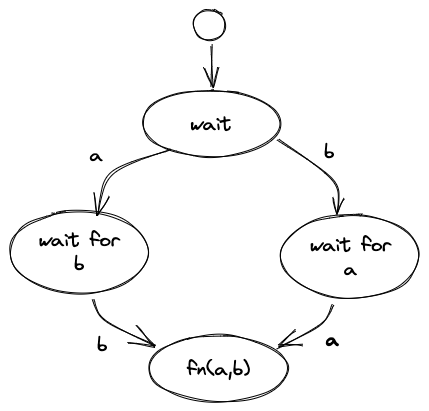

# 2023-04-25-Syncing Inputs# Synchronizing Inputs

```
def handle(self, port, message):
  if port == "a":
    self.a = message.data
    try_send()
  if port == "b":
    self.b = message.data
    try_send()

def try_send(self):
  if self.a and self.b:
    send("output", a+b)
```

You shouldn't be forced to write code like this!

It depends on your needs.  This breaks down into 2 possibilities:
1. `Try_send()` should be removed and calls to it should be replace by `Send()`
2. `Try_send()` synchronizes the two inputs, and is needed in the problem.  

2. has been (incorrectly) called "data-flow".  One automatically thinks of this solution if one is steeped in FP lore.  For example, `plus(a,b)` makes no sense unless both `a` and `b` have arrived.  But, there are waaay more applications where `fn(a)` should be decoupled from `fn(b)`.

Currently, the simplified 0D (and odin0D, therefore) has a bug wherein (1) doesn't seem to work right when bolted to exisiting synchronous code.  We're trying to fix that. Note that the input handler *does* something, it simply can't produce an *output*.

Yes, if you really, really need to sync up the two inputs, then HSMs are one good way to go.  You could do this, also, in ad-hoc code using flags, or you could use something else, like Drakon.

This sync'ing idiom is very common and was well-understood in hardware design in 1960.  It's called "a race condition".  In fact, it is the *only* real race condition - everything else programmers call "race conditions" are self-imposed accidental complexities due to the misuse of functions to solve this problem.  Off the top of my head, the diagram is...




## Pseudocode

### No Wait Version

In most cases, you don't need to synchronize the arrival of `a` and `b`.  So, you just *process* the arrivals separately, as appropriate.

```
def handle(self, port, message):
  switch (state):
    case *:
      switch (port):
        case a:
          r = DoSomethingWithA (message.data)
          send(firstOutput, r)
        case b:
          r = DoSomethingWithB (message.data)
          send(secondOutput, r)
```

## Synchronized Version
In rare circumstances, you want to wait for both `a` and `b` to arrive.  This is the "default" for function-based programming, but, is not necessary in most real-world cases.

In such cases, you need something like the above state diagram.

```
def handle(self, port, message):
  switch (state):
    case wait:
      switch (port):
        case a: saved [a] = message.data ; state = wait_for_b
        case b: saved [b] = message.data ; state = wait_for_a
    case wait_for_a:
      switch (port):
        case a: saved [a] = message.data ; state = do_something
    case wait_for_b:
      switch (port):
        case b : saved [b] = message.data ; state = do_something
    case do_something:
      switch (port):
        case *: send (output, saved [a] + saved [b]) ; state = wait
```

