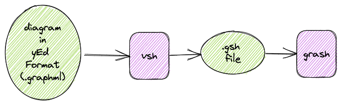
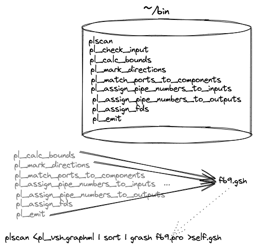

# 2023-05-1-VSH Visual Shell Working PaperVSH is an experimental attempt at creating a shell language that uses diagrams instead of text for programming the actions of the shell.

The original attempt is in the repo https://github.com/guitarvydas/vsh.

This version consists of two main parts:
1. A Compiler from diagram syntax to .GSH syntax
2. An Interpreter of .GSH programs.

In the original...
1. The diagram editor used was yEd.  It is much like draw.io or Excalidraw, etc.  The rest of the code assumed knowledge of the exact details supplied by yEd.
2. The diagram compiler was written as 8 lumps of PROLOG and one lump of Lisp that preprocesses the XML diagram format (.graphml) into a form that is compatible with PROLOG (.pl).  Later, all of the PROLOG code was replaced by Lisp imperative code to show that the use of PROLOG was not a vital part of the solution.
3. The .gsh interpreter was written in C and translates 8 simple instructions into UNIX system calls, such as `execv()`, `dup2()`, etc.  The C program was called *grash*.

!

## Moving Forward into Odin0D
Porting VSH to Odin0D and draw.io might be done in an incremental manner:

### Bootstrap Phase 1
1. Redraw the VSH diagram https://github.com/guitarvydas/vsh/blob/main/Diagram-Compiler-As-A-Compilable-Diagram.jpg in draw.io that is compatible with Odin0D.
2. Implement each Component in the diagram as a Odin shell-out Linux process that calls the Lisp and PROLOG code.
3. Regression test.  See that the new VSH produces the same output as the old VSH.  See that the new output runs under grash.c in the same way that the old VSH used to run.

### Bootstrap Phase 2
Wrap an Odin0D component around *grash*, then have the compiler pipeline feed output directly into the *grash* component, instead of using the 2-step process used in the original (original process: compile to .gsh file, interpret .gsh file).

### Bootstrap Phase 3
Rewrite grash.c in Odin.  Retest Phase 2.

### Bootstrap Phase 3
Rewrite all components in Odin, replacing Lisp and PROLOG.

## May 1, 2023 - Update

In Vsh, the name of a component is a UNIX/Linux command that takes input from stdin and outputs to stdout.  The command must be found on $PATH.
!

## Usage
### build grash interpreter
$ cd grash
$ make
### build commands from .pl (executables built from PROLOG source using gplc)
### and run commands to build fb9.gsh (vsh compiler as .gsh)
$ cd ../pl_vsh
$ mkdir ~/bin
$ ./grun
#### build scanner for .graphml to .pro (executable built from Lisp source using SBLC ; tweaked to generate PROLOG facts in factbase)
$ make
### compile diagram (scan diagram to fb1.pro, run fb9.gsh with input fb1.pro to create self.gsh (fb9.gsh again, this time self-compiled))
$ ./run

### sketch

!

## Update 2023-05-02
VSH and Grash can be thrown away if VSH2 replaces their functionality.  

The point of VSH was that you could build a diagram compiler using less than 10 commands that futz with factbases (triple-stores).  

The points of Grash are
- that "the important parts" of Bash can be replaced with only 8 instructions.  The rest of the stuff is better handled by Python, JavaScript, etc.  It wasn't obvious at the time, but Bash can be split into 2 major sections - the sync part and the async part.  The sync part does the string manipulation/substitution, variables, etc.  The async part is about pipelines (aka 0D).
- If you constrain/restrain the filtering pipeline, instead of trying to do compiling in a full-blown functional manner, the job of compiling becomes much, much simpler.
- VSH + Grash shows how to *compile* a diagram.  The idea of *interpreting* a diagram is simpler, but, never really occured to me.
- VSH + Grash was originally intended to make a point about FBP.  That point is not very relevant anymore.  That train of thought led to 0D, which is a much simpler way of saying what I wanted to say.  If you understand 0D, you don't really need to understand the POC2012 of VSH.
