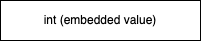
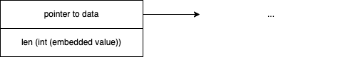
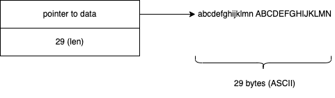
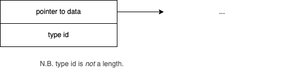

# 2023-06-03-Assembler 101## Overview
I want to understand what some of the basic datatypes in Odin look like.

## How to Run Experiments That Reveal the Structures

I write little test programs, then run them in a debugger and disassemble them.

I show how to edit/compile/debug/disassemble small bits of Odin code in this short video https://youtu.be/pBbFuSwaIFY.

In the video, I also discuss how to avoid compiler optimizations and how to avoid too much detail at first.

## Data Shapes
### int

### slice

### string

### any


```
any :: struct {
    data: rawptr,
    id: typeid,
}
```

## Appendix - Experiments
### Code (Odin)

```
package odinasm

pt0 :: proc (x, y : int) -> int {
  return x + y
}

pt1 :: proc (x : int) -> int {
  return x
}

pt2 :: proc (x : any) -> any {
  return x
}

pt3 :: proc (x : []int) -> []int {
  return x
}

pt4 :: proc (s : string) -> int {
  return len (s)
}

pt5 :: proc (s : string) -> string {
  return s
}

main :: proc () {
  z0 : int = pt0 (65, 66)
  z1 : int = pt1 (65)
  z2 : any = pt2 (65)
  z3 : []int = pt3 ([]int{65,66,67})
  z4 := pt4 ("abcdefghijklmn ABCDEFGHIJKLMN")
  z5 := pt5 ("abcdefghijklmn ABCDEFGHIJKLMN")
}
```

N.B. There is currently no experiment regarding the *any* type.  Understanding of *any* came about through conversations with Zac Nowicki.

### Disassembly
#### pt0
```
odinasm.bin`odinasm.pt0:
    0x100006cb0 <+0>:  movq   %rdi, -0x8(%rsp)
    0x100006cb5 <+5>:  movq   %rsi, -0x10(%rsp)
->  0x100006cba <+10>: jmp    0x100006cbc               ; <+12> at main.odin
    0x100006cbc <+12>: movq   -0x8(%rsp), %rax
    0x100006cc1 <+17>: movq   -0x10(%rsp), %rcx
    0x100006cc6 <+22>: addq   %rcx, %rax
    0x100006cc9 <+25>: retq
```
#### pt1
```
odinasm.bin`odinasm.pt1:
    0x100006e80 <+0>:  movq   %rdi, -0x8(%rsp)
->  0x100006e85 <+5>:  jmp    0x100006e87               ; <+7> at main.odin
    0x100006e87 <+7>:  movq   -0x8(%rsp), %rax
    0x100006e8c <+12>: retq   
```

#### pt2
```
odinasm.bin`odinasm.pt2:
    0x100006e90 <+0>:  movq   %rsi, -0x8(%rsp)
    0x100006e95 <+5>:  movq   %rdi, -0x10(%rsp)
->  0x100006e9a <+10>: jmp    0x100006e9c               ; <+12> at main.odin
    0x100006e9c <+12>: movq   -0x10(%rsp), %rax
    0x100006ea1 <+17>: movq   -0x8(%rsp), %rdx
    0x100006ea6 <+22>: retq   
```

#### pt3
```
odinasm.bin`odinasm.pt3:
    0x100007010 <+0>:  movq   %rsi, -0x8(%rsp)
    0x100007015 <+5>:  movq   %rdi, -0x10(%rsp)
->  0x10000701a <+10>: jmp    0x10000701c               ; <+12> at main.odin
    0x10000701c <+12>: movq   -0x10(%rsp), %rax
    0x100007021 <+17>: movq   -0x8(%rsp), %rdx
    0x100007026 <+22>: retq   
```
#### pt4
```
odinasm.bin`odinasm.pt4:
    0x100007030 <+0>:  movq   %rsi, -0x8(%rsp)
->  0x100007035 <+5>:  jmp    0x100007037               ; <+7> at main.odin
    0x100007037 <+7>:  movq   -0x8(%rsp), %rax
    0x10000703c <+12>: retq   
```
#### pt5
```
odinasm.bin`odinasm.pt5:
    0x100007040 <+0>:  movq   %rsi, -0x8(%rsp)
    0x100007045 <+5>:  movq   %rdi, -0x10(%rsp)
->  0x10000704a <+10>: jmp    0x10000704c               ; <+12> at main.odin
    0x10000704c <+12>: movq   -0x10(%rsp), %rax
    0x100007051 <+17>: movq   -0x8(%rsp), %rdx
    0x100007056 <+22>: retq   
```


---

#### pt9
```
pt9 :: proc (s : string) {
    pt7 (raw_data (s))
}
```

```
odinasm`odinasm.pt9:
    0x1000041c0 <+0>:  subq   $0x28, %rsp
    0x1000041c4 <+4>:  movq   %rdx, 0x10(%rsp)
    0x1000041c9 <+9>:  movq   %rsi, 0x8(%rsp)
    0x1000041ce <+14>: movq   %rdi, (%rsp)
    0x1000041d2 <+18>: movq   (%rsp), %rax
    0x1000041d6 <+22>: movq   %rax, 0x18(%rsp)
    0x1000041db <+27>: movq   0x8(%rsp), %rcx
    0x1000041e0 <+32>: movq   %rcx, 0x20(%rsp)
    0x1000041e5 <+37>: movq   0x10(%rsp), %rdx
->  0x1000041ea <+42>: movq   %rax, %rdi
    0x1000041ed <+45>: movq   %rdx, %rsi
    0x1000041f0 <+48>: callq  0x1000040d0               ; odinasm.pt7 at main.odin:35
    0x1000041f5 <+53>: addq   $0x28, %rsp
    0x1000041f9 <+57>: retq
```

0x28 = 40 decimal
```
odinasm`odinasm.pt9:
    0x1000041c0 <+0>:  subq   $0x28, %rsp
```

```
    0x1000041c4 <+4>:  movq   %rdx, 0x10(%rsp)
    0x1000041c9 <+9>:  movq   %rsi, 0x8(%rsp)
    0x1000041ce <+14>: movq   %rdi, (%rsp)
```

```
    0x1000041d2 <+18>: movq   (%rsp), %rax
    0x1000041d6 <+22>: movq   %rax, 0x18(%rsp)
    0x1000041db <+27>: movq   0x8(%rsp), %rcx
    0x1000041e0 <+32>: movq   %rcx, 0x20(%rsp)
```

```
    0x1000041e5 <+37>: movq   0x10(%rsp), %rdx
->  0x1000041ea <+42>: movq   %rax, %rdi
    0x1000041ed <+45>: movq   %rdx, %rsi
```

```
    0x1000041f0 <+48>: callq  0x1000040d0               ; odinasm.pt7 at main.odin:35
```

```
    0x1000041f5 <+53>: addq   $0x28, %rsp
    0x1000041f9 <+57>: retq
```