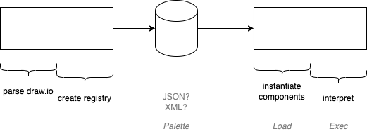

# 2023-06-04-0D v2 Working Paper- Odin syntax is getting in the way
- conflating too many issues
- simplify, allow load&go to be written in any language
- Message needs to be essentially untyped - transport layer message
- how to use existing Odin0D code, while allowing experiments with changes to runtime?

## Current Status

## Divide & Conquer
