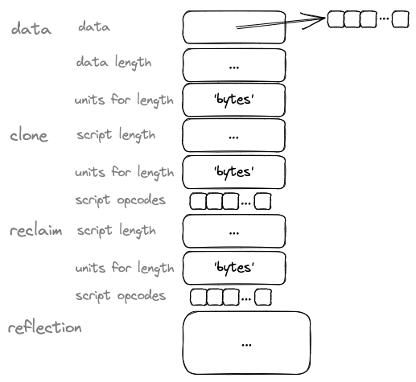
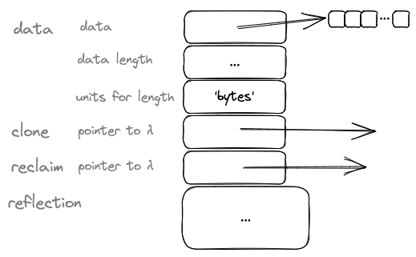
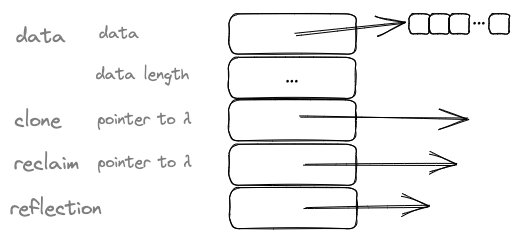
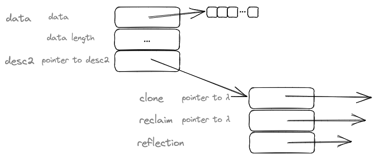

# 2023-06-11-Datum Working Paper# Datum Working Paper

This working paper proposes that *data* is always a 5-slot array of pointers, plus a lump of data bytes.

Premature optimization leads to epicycles and we have been on that path from some 50+ years.  

Programming is becoming more complicated, but, I argue that this is not making programming better.

This *looks* inefficient by the usual standards, but, do we actually care?  Let's continue and see what the effects will be.  My guess is that this proposal will reduce code bloat while increasing data bloat.  Will the trade-off be worth it?  

The way to reduce bloat is to *normalize*. 

This is a work in progress, a set of thoughts about how data could be stored and manipulated in computers.

Note that I have used the term *Datum* elsewhere in the past.  In this working paper, the term *Datum* refers to a single slot of information in computer memory.

## VTable For Each Datum

The term *vtable* is associated with the C++ programming language.  It refers to a table of pointers to functions that implement OO (Object Oriented) *classes*.

In this working paper, we consider that each slot in memory is like a small object, with its own *vtable*.

The usual form of data in memory consists of *slots* that contain only the data itself, or, a pointer to the data.

In this working paper, we consider an in-memory form that includes a cubby-hole for actual data or a pointer to data plus a small set of functions that describe the data plus a small amount of information about the data that can be used for *reflection*.

In the past, it was considered wasteful to use memory for anything other than data and pointers, due to cost of memory.  In 2023, though, memory is much less expensive and much more abundant.  We can, at least, consider storing more information about each *Datum* in memory.  

The main question that needs to be answered is "does this expanded format help create 'better' programs?".  What does 'better' mean?  Can programmers write programs more quickly (DX - Developer eXperience).  Are programs more robust (UX - User eXperience)?  Are programs easier to understand ("reason about" - AX - Academic eXplanation)?

Goals to work towards:
- decoupling data-flow from control-flow
- reducing bloat.

## Control Flow vs. Conditional Evaluation
In mathematics, functions are often defined in a conditional manner.

For example, the value of a function might be calculated one way if the input is greater-than-zero, one way if the input is zero and a third way if the input is less-than-zero.

This kind of conditional evaluation was espoused in McCarthy's Lisp 1.5, as *COND*.

Another kind of conditional evaluation was espoused in FORTRAN - *IF...GOTO*. This kind of evaluation affects the sequencing - the *control flow* - of a program script.  Programs boil down to a sequence of *opcodes* executed by an electronic machine, most often called a *computer* (which is an unfortunate name, since it implies only a single use-case for how the machine might be used).

Conditional function evaluation and control flow are separate kinds of evaluations.  For example, control flow involves propagation delays and sequencing in *time*, whereas conditional function evaluation assumes that *time* is not involved and that conditional evaluation happens instantaneously.

Traditionally, a combination of *conditional evaluation* plus *state* have been used to implement various control flows. This has resulted in problems 
- problems which have caused programmers to seek workarounds - also known as *epicycles* and *accidental complexity*
- problems which have caused notation-designers (language designers, academics) to outright forbid the use of *state* everywhere in efforts to remove the unwanted cross-coupling of concepts.  This forbidding causes cognitive dissonance when applied to a science about computers, since CPUs operate on the basis of *mutation* of *state* (aka registers, RAM).
- problems which have caused notation-designers to declare that *control flow* is undesirable. This anti-control-flow stance causes cognitive dissonance when applied to a science about *computer*s, since CPUs operate on the basis of *control flow* (and *state* and *conditional evaluation*).

### State Is Not Bad
State, in itself, is not bad.  It is a fact of life.  CPUs inherently have state (registers, RAM).

Ad-hoc use of state is bad.

State that leaks information into other components is bad.

Use of state can be elided through the use of isolation and nesting.  Encapsulation, as espoused by OO, is a weaker form of isolation.  Encapsulation deals only with data.  Isolation deals with data *and* control flow.

The use of input and output ports and the restriction that all data must flow through ports is a way to accomplish isolation and nesting.

State is often used to implement ad-hoc control flows.  It is bad to allow such ad-hoc implementations to cross-couple with other code units.  When state is fully isolated, we cannot care how it is used.

### Control Flow Is Not Bad
Control flow, in itself, is not bad.  It is a fact of life.  

CPUs inherently have control flow.  CPUs are designed to execute instructions (aka *opcodes*) in a sequential manner, with propagation delays.

Note that this does not mean that all higher level programming languages must be sequential in nature, only that they must produce scripts of sequential operations.

### Side-Effects Are Not Bad
Side-effects, in themselves, are not bad. They are a fact of life.  

CPUs inherently have side-effects, in the form of mutation of registers and mutation of RAM.

## VTables Per Datum - Again
So, does the concept of treating each *Datum* as a tiny *class object* alleviate some of the above problems?

## What Do We Need To Know About Low-Level Data?
A *Datum* can be described, generally, by

- a pointer to an collection of bits
- a length
- a unit for the length, e.g
	- bits
	- bytes
	- pointers
- how the *Datum* is allocated, 
	- how to make a copy of it
	- how to reclaim storage used by the *Datum*

## Bytes
The choice of treating groups of bits as groups of 8, was essentially arbitrary.

Groups of 8 bits are called *bytes*.

Various other groupings were tried in the early days of computer design, e.g
- groups of 12
- groups of 4
- groups of 3
- Huffman encodings (variable sized groups, based on frequency of occurrence).
- etc.

For various reasons, *bytes* were adopted as the universally accepted grouping for bits in computers.

Considerations for grouping included issues such as optimization of hardware paths.  It requires many more physical wires to access single bits in memory.  For example, memory addressing requires 3 fewer wires - one wire for each bit - (2³ = 8) - to access memory as *bytes* instead of as *bits*.  In the case of 16-bit addressing, 16 wires (one wire for each address bit) can access 524,288 bits of data in memory (65,535 x 8 = 524,288).  Larger word sizes (16, 32, 64 bit words - all multiples of 8-bit *bytes*) allow economical physical access to larger numbers of bits, while causing new kinds of problems, e.g. *alignment* - where certain byte offsets (addresses) are time-wise more efficient to access than other byte offsets.

## Allocation

A *Datum* is always allocated in memory
- *registers* are just *really fast* memory locations
- RAM is Random Access Memory - commonly referred to as "memory".  RAM is a physical array of bits.  An *address bus* sets the index into the array and the data to be stored/retrieved is presented on the *data bus*.
- Disk is *really slow* memory, but, very inexpensive to implement physically as you can pack more bits onto a disk at a very much lower price than you can pack into RAM or registers
- ROM - Read Only Memory.  Like RAM, except that it is cheaper to implement and cannot be easily (if ever) mutated.  Versions of ROM include (1) immutable ROM and (2) mutable ROM, albeit through a laborious process.  Immutable ROM consists of hard-wired bits on a hardware chip.  Mutable ROM consists of bits on a chip that can be erased and reused using processes involving UV light and high voltages.

RAM is accessed from the CPU by use of an address which is a set of bits placed on the hardware address bus.  In programming languages, this kind of address is commonly called *pointer*s.  *Pointer*s are simply integer indices into a physical array of RAM cells.

Registers are addressed using hard-wired addresses built into CPU opcodes.  We usually just conflate the addressing and storage for these items with a single term *register*.

Bits on disk are accessed through a much narrower - albeit much slower - hardware pathway (wires) and require a considerable amount of extra software layers to improve organization of bits on disk.  This software is usually called a *file system*.

### Reclaim - Garbage Collection
We need to know whether the memory used by the *Datum* can be reclaimed and reused.

Is the *Datum* saved in RAM?

Is the *Datum* saved in a register?

Is the *Datum* saved on a disk?

Is the *Datum* saved in ROM?  I.E. can the storage be reclaimed at all?  In programming languages this is often called `const`.  Under the covers, many programming languages store functions in ROM, but, not all functions. Languages that allow on-the-fly creation of anonymous functions cannot store those created functions in ROM.  The `const` concept is actually not detailed enough - it might mean that the language prohibits redefinition of the data and/or it might mean that the language compiler must store the data in ROM.  For example, *string* constants are often stored in ROM.  Early versions of programming languages created *string* constants in RAM, which allowed mutation of such "constants" which led to problems in understanding the programs (by humans (computers had no problem with this)).

## Allocation of Descriptor vs. Allocation of Data
Let's say - for starters - that a *Datum* consists of 2 parts
1. the data
2. the descriptor (aka header, data structure, etc.).

This gives at least 4 possible allocations:
1. data and descriptor in ROM
2. data and descriptor in RAM
3. data in RAM, descriptor in ROM
4. data in ROM, descriptor in RAM.

In all of the above RAM variants, the storage can be reclaimed.  Is the reclamation performed explicitly (heap), or, is the reclamation done automatically (callstack)?

In the ROM cases, the storage in ROM cannot be reclaimed, which, for our purposes, is the same as automatic reclamation - i.e. no need to explicitly call the reclamation method, or, the reclamation method is a no-op.  Checking to see if the reclamation method needs to be called will require control-flow code, whereas always calling the reclamation method requires less code but might be less efficient, time-wise.

## First Attempt
So, for starters, lets take a blunderbuss approach.  A *Datum* consists of the following fields:
- a pointer to the actual data bits
- a integer length of the data
- an integer unit of length - bits, bytes, pointer, other
- a *clone* method 
- a *reclaim* method ()
- a block of data used for *reflection*.

*Clone* is `malloc()` plus `memcpy()`.

*Reclaim* is often called GC, for Garbage Collection.

*Method*s are sequences of *opcodes*.  The sequences are variable in length, so
- we can store *methods* as *pair*s - length and sequence of bytes
- we can store *method*s as pointers to sequences of bytes, and, allow the CPU to know how to detect the end of the sequence (i.e. length not needed, CPU executes a `RET` instruction to terminate the *method*).

The first method requires us to calculate where the *reclaim* *method* begins, using stored *length* for the *clone* method.

!

In fact, the *clone*, *reclaim*, and, *reflection* data could be stored as *Datums* themselves.  Where does it stop?  I choose - arbitrarily - the above as the bottom-most case.

The second method - using pointers to functions - allows us to treat the *Datum* as an *array* and to calculate the location of the *reclaim* *method* using cheaper indexing and indirection operations.!

In this case, all of the slots are of the same length and we can just *index* into the descriptor.

Again, we are faced with an allocation issue - are the functions for *clone* and *reclaim* allocated in ROM or in RAM?

Hmm, let's continue with the blunderbuss approach and make the assumption that *clone* and *reclaim* are *Datum*s themselves.

Is that enough?

Hmm, what does it mean to *clone* a function?  Nothing, I think.  So, in this case, *clone* is a no-op.

What does it mean to *reclaim* a function?  The function could be allocated
- in ROM
- on the callstack
- in RAM.

In the first two cases, *reclaim* is a no-op.  The storage cannot be reclaimed, or, the CPU automatically reclaims the storage by popping the callstack.  Popping the callstack is usually hard-wired into CPUs, so is very efficient, time-wise.

A function might be allocated on-the-fly on the heap, in RAM.  In that case, we might want to reclaim the storage when the function is no longer needed (is that even meaningful for such a low-level function?).  In that case, the *reclaim* method is not a no-op and is written by the compiler.

I like the second approach better, for arbitrary aesthetic reasons, so I will continue with it and I will simply ignore the first approach.

## Reflection

I am currently ignoring the *reflection* data.  I don't know what I want to store therein.  Simply ignoring that issue allows me to use *divide and conquer* and to consider only the sub-problem of how to design the other part.

Later, I will revisit the issue of *reflection*, but, for now, I will simply ignore the issue completely.  I may continue to draw the *reflection* data as an amorphous blob to remind myself to think about it at some later date.  At the moment, I'm guessing that the *reflection* data will consist of a pointer to some descriptor, but, I don't know for sure yet.  I don't want to go down that twisty little passage yet.

## Second Attempt - Optimization

Let's optimize-away the *units* field, on the assumption that all CPUs deal with units in terms of *bytes*.

Note that this assumption requires compilers to figure out alignment issues.  I.E. we will assume that the block of bytes has been appropriately optimized by the compiler to take into account alignment issues.  A 64-bit machine uses addresses that are 8 bytes long.  Does the 8-byte address address a bit, a byte, or ..., an 8-byte word?[^segreg]  Compilers can ensure that fields in a structure are on the appropriate boundary, making access to data more efficient - time-wise - while adding data bloat and data inefficiency.

[^segreg]: In the extreme case, we have *segment registers* that allow addressing huge amounts of memory by using 2-piece pointers.  (1) A pointer (index) to a *segment*, and, (2) a pointer (index) to a byte within that *segment*. This kind of thing results in code bloat, requiring several instructions to load a full-blown pointer.  We see variants of this approach in allowing opcode operands to be of various sizes, e.g. byte, word, and branch opcodes that are "short" and "long".

We will assume that the block of data bytes is internally properly aligned and that the *clone* method does the appropriate math to properly align the beginning of the block when cloning to RAM.  In this case, the *reclaim* method needs to know the math used by the *clone* method so that all bytes can be reclaimed without creating data leaks.

We will, also, begin drawing the *reflection* field as a pointer to some unknown blob of data.

!

Note that, up until now, we usually think that *data* is stored directly in memory or as a pointer in memory to an allocated lump of memory containing the data.

Then, we backed into the idea that the concept of *pointers* throws away too much information, so, we invented *slices* which are *pairs* of `{pointer, length}` struct-lets.

This working paper proposes that *data* is always a 5-slot array of pointers, plus a lump of data bytes.

This *looks* inefficient by the usual standards, but, do we actually care?  Let's continue and see what the effects will be.  My guess is that this proposal will reduce code bloat while increasing data bloat.  Will the trade-off be worth it?  

Premature optimization leads to epicycles and we have been on that path from some 50+ years.  

Programming is becoming more complicated, but, I argue that this is not making programming better.

The way to reduce bloat is to *normalize*.  We are examining an extreme version of *normalization*.  What will this bring?  Each *Datum* is an object-let.  How much - if any - will this reduce code bloat?  How much will this increase data bloat?  Will this kind of extreme *normalization* make stage 1 of programming so easy that it will be worth the bloat?  Will we be able to perform stage 2 - optimization - on this *normalized* form?  Thus far, my guess is *yes* and *yes*.  So, I will continue down this line of reasoning...

Aside: it seems "obvious" that the above can be implemented simply, even in tiny languages like Sector Lisp and its successor BLC.  

I'll probably use Odin (improved C) to keep me honest at the byte level, or, LispWorks due to its mature IDE.

## Third Attempt - Optimizing the Optimized Structure

!

In this version, we notice that a lot of the same information is shared across many variables.  We can reuse the information and save space at the cost of adding an indirection.  We can add a 2nd level descriptor and simply point to it, saving some 2 address slots per *Datum*.

This now adds a new wrinkle.  Is *desc2* allocated in ROM or in RAM?  *Desc2* can be allocated differently from the main descriptor.  Should it be allocated differently?  I'm guessing that there are fewer combinations of *clone*/*reclaim*/*reflection* than there are *Datum*s, so it would make sense to *always* allocate the 2nd level descriptor in ROM and to let the compiler suss out the combinations that are truly needed.  The compiler must work harder, but, we hope that this work can be amortized over the resulting code.

I don't see how to reduce this further - at this higher level - so, I will stop and try to implement this.

Future, lower-level optimizations might include:
- reducing the size of the *data length* field
- making the *data length* field variable in size, on the assumption that most lengths can be represented in 1 or 2 bytes (the various lengths in actual code could be measured first, before trying this optimization)
- fooling with the length of the pointers by playing tricks with data alignment, e.g. if we guaranteed that the actual data was always placed at convenient addresses, we might be able to shave a few bits off of the pointer, likewise, we might be able to shave bits off of the 2nd level descriptor pointer or off of the pointers in the 2nd level descriptor itself.

Again, it makes no sense to try any of these optimizations now.  That would be *premature optimization*.  Let's get it working first and see what ideas that generates.

## Why?

Why am I thinking about this?  How did I end up here?

My ultimate goal is to draw pictures of code and to share patterns done this way.  I know, from experience, that this will create several beneficial program patterns that cannot be thought of using only textual, sequential code.  I, also, know that certain kinds of programming are *just easier* when written in diagrammatic form.  For example, Christopher Alexander-like Patterns contain an underlying - hidden - assumption.  It is assumed that patterns can be snapped together and un-snapped to form various interesting combinations.  Current programming languages, based on functions, defeat this assumption.  They all start out with a hard-wired pattern: the Sequential Pattern.  Sequential programs are inherently welded together with optimizations.  Breaking the welds or building patterns on top of welded-together code is possible, but, it is *difficult*.  Difficulty encourages avoidance.  Certain solutions and certain combinations of Patterns are simply avoided and not thought about.  I don't want to draw diagrams just because I like diagrams, but, because figures on diagrams represent isolated Pattern units.  If you can compile a diagram to working code, then you are using a Pattern Language.  You can, later, reduce the diagrams back down to text, but the ultimate test of a Pattern Language is that of drawing a diagram of a solution then rearranging it - easily and quickly - to form another solution to another unrelated problem.

An example of this method is to build an Obsidian markdown to Github Pages markdown blog converter.  This is a trivial program that needs about 1 line of Bash code.  Doing it with diagrams proves that useful things - albeit trivial - can be done with diagrams

In addition to the above, I feel that I need to explain how to do all this.  Explanations using English are too imprecise.  I need to prove that I can make a machine - a computer - understand how to do this.  To this end, I expect to write the *kernel* for 0D in some higher-level form.  I call this higher-level form RT (recursive text).  My sub-goal is to understand a new detail about this stuff (currently called *yield queues*) by looking at the problem using a notation invented for describing the problem, instead of using a detail-laden existing programming language. 

A more interesting example of the above methods is to build a compiler.  I think that is trivial to do, not much harder than building an Obsidian markdown to Github Pages markdown blog converter. I need to build a Component that invokes Ohm-JS.  Then I can build a compiler in several easy steps.  I am hoping to make that compiler be the above rt0D kernel (compiler).  Currently, rt0D is a pipeline with about 17 stages programmed in Bash and Ohm-JS and FAB.  Converting that pipeline into a diagram should be easy and should show how to build a compiler this way.  17 *sounds* like a lot of stages.  We're used to seeing single-pass compilers, but, that kind of thinking comes from brain-lock coloured by 1950s biases.  In the end, a programmer doesn't care how many stages are in a compiler, as long as the compiler works and is "fast enough".  In the end, a language implementor doesn't care how many stages are in their compiler, as long as it's quick and easy to build the compiler.  Today, the act of building a compiler is not quick and easy.  I claim that there is a much easier way to implement compilers, but, it ain't gonna happen by piling more niggly details onto the creaking tower of epicycles we now have.

---
## June 14, 2023 update
- dropped 2-level optimization, implementing *second attempt* for starters
- added `repr` field for string representation (this should probably be folded into the reflection info, in the future)
---

## Github
My intermediate work is up on github

### RT0D
https://github.com/guitarvydas/rt0d
### Datum
https://github.com/guitarvydas/datum
(not much there yet - starting work on this today June 11, 2023)
### FAB
https://github.com/guitarvydas/fab
#### example of using Ohm-JS and FAB to build a game language
https://github.com/guitarvydas/fabghoststars
### Ohm-JS
https://ohmjs.org
