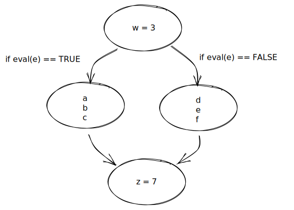
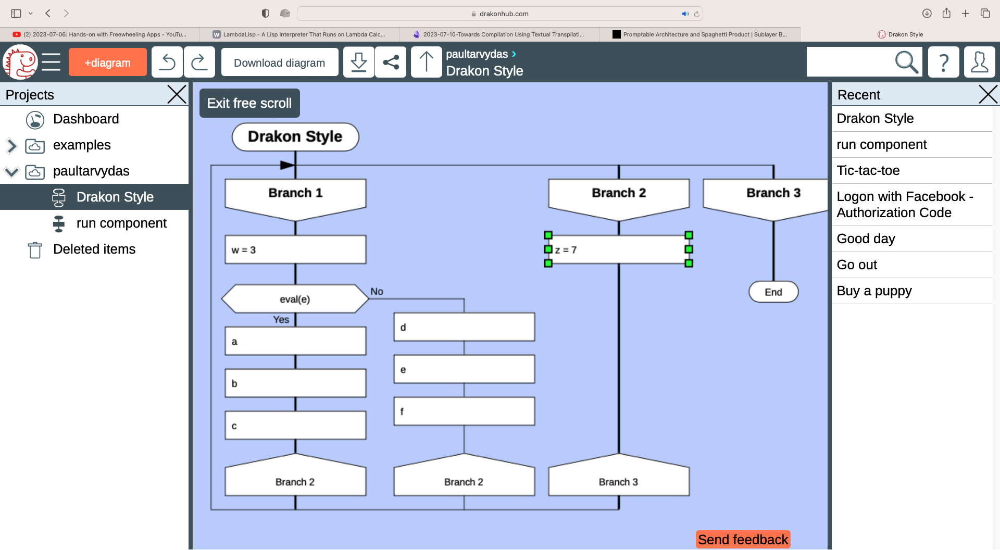

# 2023-07-11-Continuation-Passing Style vs. Other Styles## Continuation Passing Style vs. Other Styles
*Very* rough sketch of various programming methods.  Lots of details and embellishments have been elided for clarity...

## Pseudo Code
```
w = 3
if (e) then { a ; b ; c } else {d ; e ; f}
z = 7
```
## Imperative Style
```
    w = 3
    if (eval(e)) then {a ; b; c; goto L1;} else {d ; e; f; goto L1;}
L1: z = 7
```
## Co-Routine Style
```
  w = 3
  if (eval(e)) then call f1() else call f2()
return here:
  z = 7

function f1 () {
  a
  b
  c
  return
}

function f2 () {
  d
  e
  f
  return
}
```

## Continuation-passing Style

```
w = 3
if (eval(e)) then call f1(&f3) else call f2(&f3)

function f1 (cont) {
 a
 b
 c
 call cont
}

function f2 (cont) {
  d
  e
  f
  call cont
}

function f3 () {
  z = 7
}
```

The CALLs never RETURN.

Tail-call optimization is a way to convert CALLs at the "tail" into GOTOs without pushing more items onto the callstack.  The insight is that the *last* statement has the property that all locals (and parameters) are no longer needed, and, that a recursive call simply passes the same parameters to the same function which uses the same variables.  There is no reason to futz with the stack - you can leave the parameters on the stack (and mutate them in-place) and you can leave the locals on the stack (you need to guarantee that locals will be written-to before use and the stale values will never be used (this guarantee is preserved by the rules of FP)).

The result is something like this, under the covers:

```
w = 3
if (eval(e)) then call f1(&f3) else call f2(&f3)

function f1 (cont) {
 a
 b
 c
 GOTO f3
}

function f2 (cont) {
  d
  e
  f
  GOTO f3
}

f3:
  z = 7
```

## Interpretive Style
```
    w = 3
    if (eval(e)) then {
      eval(a) 
      eval(b)
      eval(c)
      GOTO L1;
    } else {
      eval(d)
      eval(e)
      eval(f)
      GOTO L1
    }
L1: 
  eval(z = 7)
```
## State Machine Style

!

## Drakon Style
!
## Appendix
Drakon Hub: https://drakonhub.com

Drakon desktop version (I especially liked the 3 tutorial PDFs): https://drakon-editor.sourceforge.net

Statecharts: https://guitarvydas.github.io/2020/12/09/StateCharts.html


## Appendix - Contact

Paul Tarvydas (computingsimplicity@gmail.com)

## Appendix - Blogs and YouTube and Books
https://publish.obsidian.md/programmingsimplicity (under reconstruction - let me know when you find missing links)
https://guitarvydas.github.io/ (until about mid-2022)
https://www.youtube.com/@programmingsimplicity2980 (see playlist "Programming Simplicity")
https://leanpub.com/u/paul-tarvydas (leanpub == publish books before finalizing them)
