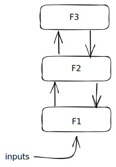

# 2023-08-24-Smalltalk Does Not Use Message PassingRegardless of which name Smalltalk uses, the kind of "Message Passing" used by Smalltalk does not resemble the kind of "Message Passing" that exists in distributed systems.

Let us use the label MP1 for the kind of thing that Smalltalk calls "Message Passing".  And, let's use the label MP2 for the kind of "Message Passing" used in distributed systems.

MP1 is really blocking, function-based calling using named parameters.  "Methods" are simply functions that are conditionally invoked based on the callee's *type*. Method calling is simply a *case* statement - on type - wrapped around a set of function calls. When an MP1 Sender "sends a message" to an MP1 Receiver, the Sender executes a CALL/RETURN dance.  It waits for a response from the Receiver. That's the same as calling a function. The only added twist is that a *case* statement is involved.

MP2 is not blocking.  When an MP2 software unit sends a Message to another MP2 unit, the Sender does not wait for a response from the Receiver.

MP1 implies synchronization while MP2 does not imply synchronization.

It is possible to fake out MP2-style invocation using MP1, but, that involves extra work, i.e. workarounds, accidental complexity caused by the impedance mismatch, aka "epicycles". These kinds of fake implementations of MP2 involve bloatware like preemption, operating systems, thread libraries, etc. These kinds of fake implementations of MP2 bring suitcases full of *gotcha* baggage with them.  We discover the *gotcha*s in an ad-hoc manner.  My favourite example is the Mars Pathfinder disaster, which resulted in the invention of the workaround called "priority inheritance". Workarounds, like *thread safety*, *preemption*, *reentrancy*, etc. are related to the ideas of faking out MP2 using only MP1.

## Synchronous vs. Asynchronous
MP1 is a synchronous protocol and implies that all method calls are blocking.

The synchronous paradigm is a good "simplifying assumption" if you want to build calculators and if you want to analyze code.

In essence, the synchronous paradigm implies that *time* is absolute and is the same everywhere in the universe.  All analysis of behaviour is facilitated by using micro-time-ticks and clocking all units under analysis using the same absolute clock source.

The synchronous paradigm is a road-block for building any other kind of thing.  It is *possible* to use the synchronous paradigm in other kinds of solutions, but, requires extra work - i.e. workarounds, which I call "epicycles", patterned after the workarounds used in pre-Copernican cosmology for shoe-horning inconvenient facts into the then-existing cosmological theory, keeping the theory alive when it was pushed well beyond its sweet spot.

The asynchronous paradigm is how Reality works.  Entities work at their own pace and do not need to be clocked in an absolute manner.

As a concrete example, think about peer-to-peer networking in a blockchain (non-permissioned).  Nodes can drop in or drop out at any time.  The blockchain protocol deals with absences.  The nodes on the chain are *asynchronous*.  There is no need to send a synchronizing clock signal to all nodes.  There are, also, versions on centralized blockchains called "permissioned blockchains", that require tight synchronization and fall outside of what is usually thought of as blockchain or p2p networking. 

As another concrete example, think about how ethernet works.  Nodes on the network are fully asynchronous and poke data onto the wires whenever they feel like doing so.  Nodes can detect data collisions (by reading back the data on the wires) and adopt a non-synchronized "back off and retry" policy, iteratively, in the rare cases where collisions do occur.
## Example
Imagine a very simple software stack, three layers deep.

When an input arrives, F1 handles it promptly then Sends a Message to F2.  F2 handles Messages from F1 and sometimes sends a Message to F3.

Using MP1, when F1 Sends a Message to F2, it must wait for F2 to return control back to F1.  Sometimes, F2 Sends a Message to F3, and, it waits for F3 to return control.  Sometimes, F1 has to wait for F3 to return to F2 to return to F1, and, sometimes F1 only needs to wait for F2 to return when F2 doesn't bother to Send a Message to F3.

Only after all of that, can F1 continue on with what it was doing.

Using MP2, though, when F1 Sends a Message to F2, it is done.  It can immediately proceed with what what it was doing.

MP2 mimics what is really going on in distributed systems, like the internet.  In a minority of cases, F1 really wants to wait for some kind of answer from F2, so F1 must run some sort of *protocol*.  This is how internet clients and servers work.

It is becoming increasingly interesting to allow "free will" and MP2-style Message Passing.  For example, in robotics, the robot's head wants to tell the the arm to move the hand closer to the doorknob, and, it trusts that the arm knows how to do this, so the head simply moves on, figuring out what else to do, on the assumption that the arm will carry out the command, without needing further micro-management.  The arm might wish to break the assigned task down into smaller steps, like moving the various independent parts of the arm to achieve the bigger goal of getting the hand closer to the doorknob.

The head can do this using MP2 style Message Passing.

On the other hand, if the robot used MP1 Message Passing, the head would have to wait for the arm to finish what it was doing, which would need to wait for the forearm, which would need to wait for the wrist, etc.  Too much micro-management will result in a jerky behaviour.  In golf, for example, this kind of over-thinking is called "analysis paralysis" and the current trend in research literature is to emphasize "outward focus" instead of "inward focus" - i.e. goal-driven behaviour, instead of micro-managed behaviour.

Browsers and Clients are a marvel of technology, but, represent only a tiny sliver of what electronic machines (aka "computers") can accomplish if allowed to.  Do we see a need for MP2-ness in other applications?  Sure.  Now that CPUs are cheap and memory is abundant, just about everything we want to do with "computers" falls into this category, .  For example, the famous pBFT paper describes how to build a very, very small State Machine protocol to allow for MP2-style Message Passing to be used in blockchain applications.  I guess that their main challenge was that of finding workarounds for the MP1 handcuffs that they were forced to use.  If you think about it, blockchain research is mainly about re-discovering protocols to allow for MP2 participants to drop-in and to drop-out of the number crunching volleys.  Humanity has already solved this problem many times over, for example, how to run business meetings when some participants are stuck in traffic and can't attend.  Nothing new here.  Nothing to see, just move on.

## Propagation Delays vs. Synchronization

What if we reduced the propagation delays substantially?  Say, the MP1-style Message Send from F2 to F3 takes only a femtosecond.  Or, better yet, the MP1 Message Send takes 0 seconds?  Things certainly go faster, but, they are still synchronized.  F1 can't move on until F2 has finished which can't finish until F3 has finished.

This situation is ridiculously inefficient.  To speed up F1, we have to cough up the big bucks to speed up F2 and F3.

What if the inputs come in bursts?  Say, the inputs come really, really quickly, but there are long pauses between bursts.  Using MP2, we would have to speed up F1, but, we could leave F2 and F3 to run at much slower rates.  The only criterion is that F3 has to finish up handling a burst before the next burst shows up.  The *system* of F1/F2/F3 only needs to run fast enough to handle infrequent bursts, but, F1 needs to be sped up.

With MP1, though, we would need to speed up F2 and F3 as well as F1.  In fact, we would need to make all three much, much faster.  The *system* F1/F2/F3 is synchronized.  F1's speed depends on F2's speed coupled with F3's speed.

## Using Really Fast MP1 Fakery

What if we built the nodes F1, F2 and F3 using MP1 fakery?

We simply implement each node using a Raspberry Pi running Linux.

Yes, that would work.

But, if you built that same system using MP2 technologies, you could avoid using Linux and use cheaper hardware and save lots of $'s.  For argument's sake, let's say that we used cheapo Raspberry Pi running lame Linuxes for F2 and F3.  We could squeeze blood out of the F1 hardware by writing the F1 code in Assembler and skipping Linux altogether and using only a few bytes of memory for F1, instead of MB of memory needed to house Linux and all of its unneeded machinery.

In fact would you be forced to use Assembler for writing the F1 code, or, could you use an MP2 programming language instead?  At the moment, I don't know of many MP2-based solutions.  Maybe micro-Python?  It appears that we know - very thoroughly - how to write bloated, MP1 systems using Linux.  Maybe we need more research into the development of MP2 languages that eschew the use of Linux and the use of expensive hardware?  I would venture to guess that game designers in the 1990's had started figuring out the cheapo hardware angle, but, they didn't figure out how to create cheapo software other than by hand-rolling it in Assembler and C.  Then, they fell for the sirens' call of software done the synchronized MP1 way.

I would guess that puny languages, like Sector Lisp, might hold they key to shrinking bloatware.  On the surface, it may look like Sector Lisp relies solely on Assembler trickery, but, I think that there is something more fundamental going on.

It would seem to me that the goal should be to keep the puny language small, not to insert doo-dads into the language, like assignment (aka "mutation").  Instead the goal should be to build outrigger preener software that optimizes puny designs, like the abandoned branch of compilation espoused by RTL and OCG.

## Ceptre
## Drawware
## CPUs Are Meant For Single-Threaded Applications
- shared, global, non-reentrant callstack hard-wired into CPU chips

- 
## Richard Feldman The Next Paradigm

 I disagree with Feldman's conclusion in https://www.youtube.com/watch?v=6YbK8o9rZf.  At about 36:00, he repeats a tired fallacy and uses it as a basis for his conclusion.  Contrary to what is commonly believed, Smalltalk Message-Passing is not the same as Message-Passing in distributed systems.  There is a huge difference between synchronous Message-Passing and asynchronous Message-Passing.  The over-use of synchronous Message-Passing begs for Accidental Complexity (aka ad-hoc workarounds, aka make-work, aka epicycles).  Smalltalk's synchronous Message-Passing is just function-calling using a case-on-type dispatch mechanism using  named parameters. I believe that the phrase "Message Passing" should be only used for describing asynchronous message passing.
