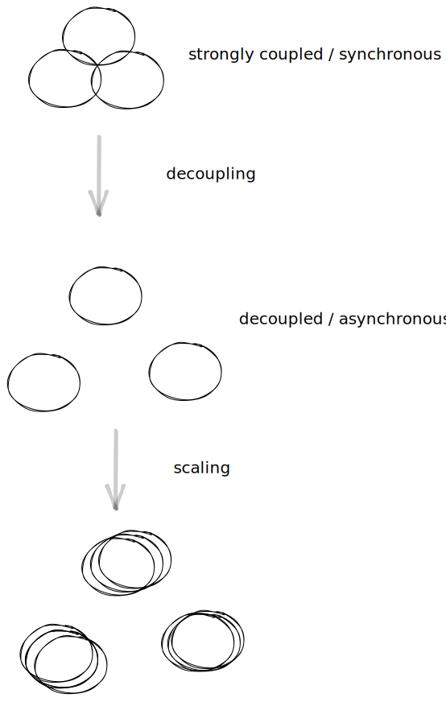

# 2023-08-28-Sync Programming vs Distributed Programming
Sync programming is complicated.

Distributed programming (aka async) is complicated.

They are not the same, though.  

They are completely orthogonal.

Using a sync-based language to program a distributed system requires extra, unnecessary  work.

Just about every 3GL today - Smalltalk, Python, JS, Rust, Haskell, etc., etc. - is sync-based.

Any language that relies on functions is - by definition - a sync language.  

The early purveyors of 3GLs used the word "synchronous" explicitly.  At the time, distributed programming was unimaginable.  So, making everything synchronous didn't seem like a problem.  In fact, making everything synchronous makes it easier to analyze system behaviour using clay tablet and papyrus technologies.

Feldman, in https://www.youtube.com/watch?v=6YbK8o9rZf, uses the cliche of "Smalltalk uses Message Passing" to conclude that the paradigm of programming in async style is bad.  He doesn't - probably due to indoctrination - differentiate the kind of message-passing used by Smalltalk vs. the kind of message-passing used in truly distributed systems, i.e. function-calling vs. queueing messages.

Sync-based message passing causes senders to block when sending a message, i.e. wait for a return value(s).

Async-based message passing does not cause senders to automatically block on send, i.e. no waiting for a return value(s).

Sync-based senders wait for a result by default and don't need to bother with sync'ing later.

Async-based senders don't wait for a result by default, and sometimes - but only sometimes - need to bother with sync'ing later. State Machines are at least one way to express this kind of thing.  Network protocols deal with these issues, too.

Humanity has developed algorithms for dealing with asynchronous thingies, but this knowledge isn't formalized in the form of clay-tablet-compatible equations known to computerists.  For example, anyone in business knows how to run a meeting when not everyone shows up on time, or, when the main speaker hasn't shown up yet.

## Sync is a Subset of Async
Async is a superset of sync.  Async systems contain many little sync components that communicate with one another.

## Efficiency
Async allows for different ways of addressing efficiency.  

An example might be a network protocol stack.  

At the bottom-most layer (F1), the hardware has to be really, really fast and the software handlers need to keep up with the hardware.  At the top layer (F3), though, evaluation can proceed more "slowly" and only needs to keep up with human users' expectations.  Humans don't perceive something to be  sluggish unless more than 20msec is required for an interaction.

## Clock-based Synchronization

Sync analysis of async systems requires a global, shared clock.  

Clock-based synchronization requires absolute timing instead of relative timing.

The idea behind synchronous analysis is the use of a fine-grained clock that is absolute, and, micro-fractalizes every action in the system.  The underlying assumption is that clock ticks are essentially instantaneous and are so fine-grained that they can simply be ignored.  

When the system is distributed over large distances, clock ticks encounter "propagation delay" (aka "latency") and cannot be ignored.  Is such cases, the technique of clocking a system cannot be used without introducing workarounds (aka "epicycles").

## Synchronization Causes Hidden Dependencies

The above example of a protocol stack illustrates that synchronization causes a thread of dependency throughout the whole stack.  The lowest levels (F1) cannot run at their own speed, they must wait for the upper layers (F3) to complete their actions before proceeding with their own low-level work.

Even when propagation delays are effectively 0, synchronization between the layers causes the whole stack to operate at a speed which is the sum of the speeds of all of the layers and the overall timing to be swamped out by the timing of the slowest layer.  Speeding up the F1 layer doesn't help if the F3 layer remains "slow" - all layers need to be sped up significantly before the whole stack can operate more quickly.  For example, if each layer needs 10 units of time to operate in the original design, the overall speed of the stack is 10+10+10 units, or 30 units of time.  If F1's efficiency is increased by 100%, the overall speed of the stack changes only to 5+10+10, or 25 units of time.  To improve the efficiency of the whole stack by 100%, from 30 units down to 15 units, each layer must be tweaked.

Instead, the asynchronous message-passing meme puts a clutch between each layer.  Layers can run at their own speed and mesh up only when necessary.  Building such clutches is easy, but, is not directly supported in hardware like synchronous gear-meshing is.  Hardware supports CALL/RETURN but does not provide hard-wired support message passing via queues.  CALL/RETURN instructions were not invented to support function-based programming, but compiler-writers find it convenient to abuse these instructions.  On the other hand, if a programmer wants to send a message, the programmer must explicitly write queue-handling code.  Writing code for queues is not exactly rocket science, but constitutes a psychological road-block anyway.

In analogy, imagine an email client that allows the user to read one message at a time, and, a message is not considered to have been "read" only when someone at the receiving end has pushed the "OK, I've read this" button.  The sender must wait for an "OK..." return message before proceeding to read the next message.  How well does this work when the sender and receiver are, both, in Berlin, Germany?  How well does this work when the sender is in Seattle, USA and the receiver is in Berlin, Germany, and, both sender and receiver sleep between 11:30pm and 7:30am local time?

The difference between the two techniques - sync and async - doesn't matter in only one use-case.  When data arrives in a steady stream, without any pauses in between, neither method produces better efficiency.  The gloves are off, though, in other use-cases, like when data arrives in bursts.
### Robotics
Now, imagine a robot that has 500 small motors running different mechanical joints in its body.  

To grasp a doorknob requires several steps, like,
1. Move the body closer to the door.
2. Open the fingers of the hand
3. Move the arm
4. Move the forearm, to get the hand to touch the doorknob
6. Close the fingers of the hand to grasp the doorknob.

Using a synchronous strategy to coordinate these actions results in jerky overall behaviour.

Human golfers know this kind of phenomenon as "analysis paralysis".  Businesses call this approach micro-management.

Using an asynchronous strategy, though, to coordinate these actions, allows each joint to operate at its own speed, resulting in an overall smooth-looking behaviour that is easier to "reason about".

The problem of creating even such simple motion is difficult to solve in either case.  

Using an asynchronous message-passing strategy allows the use of divide-and-conquer to be used to solve the problem.  The overall system is goal-driven and choreographed by a flurry of internally layered events sending command messages to autonomous sub-systems.  "Turtles all the way down".

Using a synchronous, blocking strategy forces the whole problem to be solved from one end to the other with each sub-unit depending on all other sub-units.  If one sub-unit is changed, all other sub-units must be revisited to accommodate the impact of the change.

## Analysis

Sync analysis cannot - by definition - capture the true asynchrony of a system.

Corollary: a sync programming language cannot express the true asynchrony of a computer system, without extra, unnecessary work.

## Async is Natural to Most Humans
Async is "everyday life".

Free will and all that.

People are autonomous and not - by default - synchronized.

We had to invent clocks to impose synchronization on people.  But, then, we needed to kludge the concept using timezones.

We invented the protocol of shaking hands.
## Christoper Alexander 

Underlying Christopher Alexander's famous book "A Pattern Language" is the unspoken assumption that all units are asynchronous, and, pluggable without hidden dependencies.

Asynchrony is "so obvious" to everyone - except programmers - that it doesn't need to be mentioned.

## Unavoidable Use of Sync

Using just about any 3GL forces one to use the sync meme.  Languages like Rust, Python, Haskell, JavaScript, Common Lisp, Smalltalk, etc., etc.

Any language that is function-based is sync-based.

Relational languages are not function-based, though.  

The concepts of servers and daemons are not sync-based.

## Scalability

The sync meme couples all parts of a system together.

This makes it harder to scale a system by chopping parts up into smaller units and then moving the units around.

The async meme encourages composing a system from stand-alone, decoupled units.  Moving decoupled units around to scale the system upwards is easier.  The units are already decoupled, therefore less work is required to decouple the units when scaling the system.

## The Ground Truth Has Changed

When Smalltalk was invented, you were allowed to use one (1) CPU and very little memory.  FPGAs did not exist.  Graphics cards did not exist.

CPUs cost O($100000) or more.  Each.

Computers and operating systems and programming languages had to make the best of the single CPU limitation and of the memory limitations, resulting in solutions like time-sharing and Garbage Collection.

Today, though, one can imagine a computer using many CPUs (actually, DPUs) and scads of memory.  Arduinos and Raspberry PIs are dirt cheap (O($100)) and memory devices are regularly measured in terms of MB and TB instead of KB and B.

The Art of Programming Language Design, nonetheless, is still rooted in the single-CPU-with-limited-memory mentality.

Predicting the future using outdated memes will not work.

---
## Appendix - Random Thoughts

- Distributed programming consists of islands of sync joined together by async messages

- Ceptre - islands of sync joined together by layers of sync.  Better than what we've got.  Maybe a step in the direction of little networks.

- Closures are the natural units for sync software.  Little networks of closures are the natural units for async software.

- FIFOs are used for async message queuing, recursion is meaningless in the distributed paradigm

- LIFOs are used for sync message sending - messages aren't queued, but acted upon immediately. Recursion can be used in these cases.

- Sync concurrency is not true concurrency.  Concurrency is the idea of many nodes running at their own speed.  Synchronizing the nodes, e.g. for analysis, removes this fundamental aspect.  A truly asynchronous network cannot be built if global synchrony is surreptitiously inserted into the bowels of the system. 

- Example of workarounds needed to force the sync meme onto non-sync problems: preemption, time-sharing, etc.  This led to the Mars Pathfinder disaster which spawned even more workarounds ("priority inheritance").

- Developers want preemption, to be able to kill runaway, buggy programs.  Users don't need preemption unless they are forced to use buggy programs that can run away and can corrupt one another due to the ill-advised use of shared memory.  Hardware has been developed to support this meme.  Such hardware real estate could be put to more productive use in other ways, e.g. cheaper hardware, more async DPUs per chip, etc.  

- Gaming consoles using plug-in cartridges don't have the problem of memory sharing with other apps nor of time-sharing the hardware with other apps.

- My mother doesn't need a $1000.00 laptop and doesn't need to pay tax to Microsoft and doesn't need to pay $s for buggy software with weekly updates.  She needs a $7.99 Tetris hand-held device stocked on the same shelf as cheapo calculators at Radio Shack.  My mother doesn't want "user programmability".

- Laser-focussed attention on ultra-production-optimization has made it cheaper for businesses to ship buggy software, but hasn't improved the final UX.  Users are forced to pay the ultimate costs of this kind of over-kill.

- So-called "computer science" focuses mainly on DX and mostly ignores UX.

---

# Summary

Sync programming is complicated

Async programming is complicated.

But, they are not the same.

I argue that adding the meme of little networks to your toolbelt can result in better solutions, and, can, at least sometimes, be more efficient.

Using the wrong meme to solve a problem causes complication (Accidental complexity, workarounds, epicycles).  Choose your weapons, don't have them forced upon you.  Don't approach every problem using only a single meme.

Sync is good for building fancier calculators, e.g. ballistics calculations for cruise missiles, cryptography, chatbots that hallucinate and create B.S., etc.  Async is good for GUIs, internet, robotics, blockchain, p2p, etc.

I claim that async is a superset of sync.  Async can be thought of as a bunch of sync nodes sending async messages to one another.

Feldman claims that FoC will come about through the vehement avoidance of the little network meme.  He bases his conclusion on the faulty reasoning that the sync meme is the only way to create little networks.  I claim exactly the opposite.  FoC must evolve towards little networks - networking in the small.  Maybe closures+queues plus a way to compose solutions using multiple memes.

Much more here: https://publish.obsidian.md/programmingsimplicity/2023-08-28-Sync+Programming+vs+Distributed+Programming

---

# See Also
### Blogs
- https://publish.obsidian.md/programmingsimplicity (see blogs that begin with a date 202x-xx-xx-)
- https://guitarvydas.github.io/ (up to about mid-2022)
### Videos
https://www.youtube.com/@programmingsimplicity2980
### Books
leanpub'ed (disclaimer: leanpub encourages publishing books before they are finalized)
https://leanpub.com/u/paul-tarvydas
### Discord
https://discord.gg/Jjx62ypR  ("programming simplicity") all welcome, I invite more discussion of these topics
### Twitter
@paul_tarvydas
### Mastodon
(tbd, advice needed)

