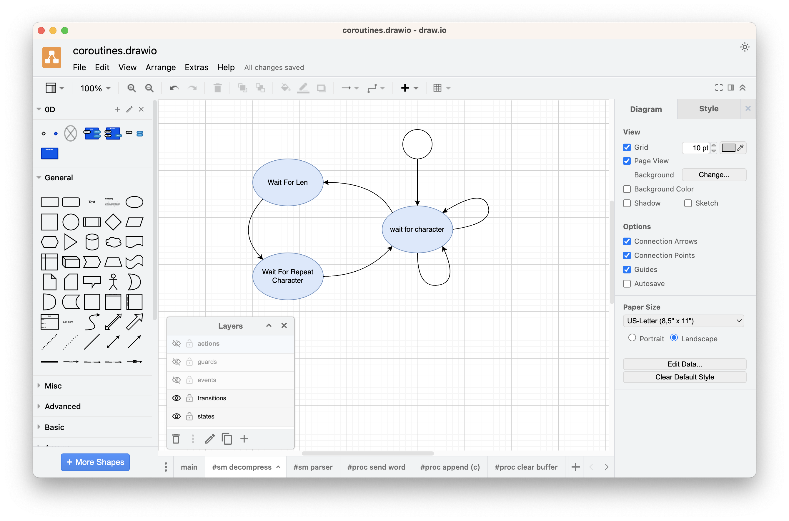
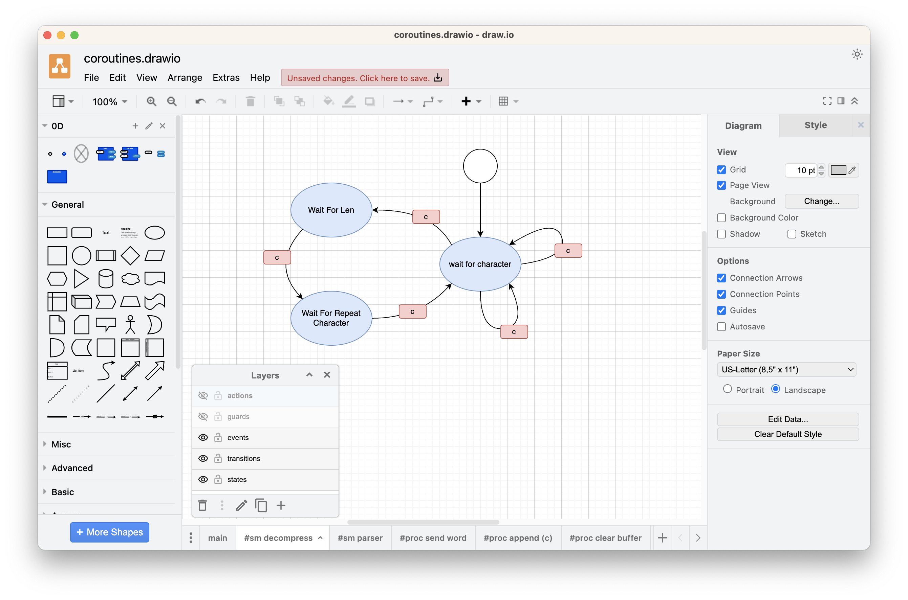
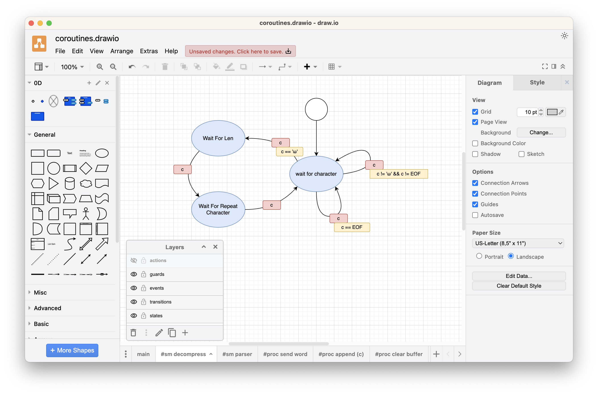
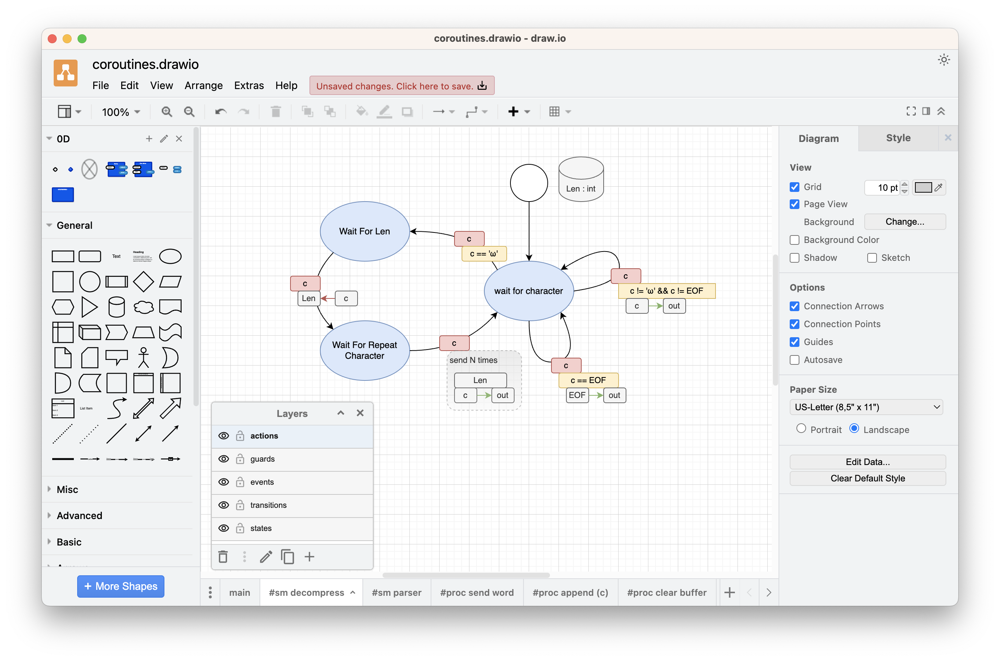
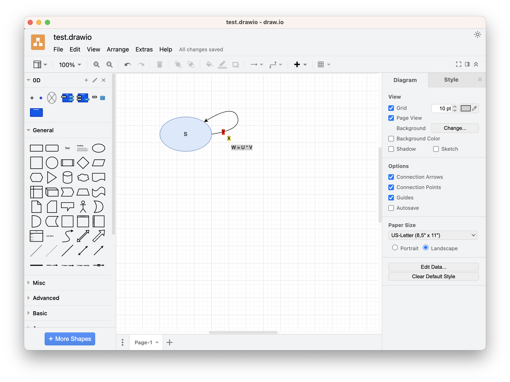

# 2023-09-01-Drawware Brainstorming
Thoughts on using draw.io to represent state machines

## Coroutines In C Decompressor

My "freehand" diagram of the Decompressor component is

The code for this is in https://github.com/guitarvydas/coroutinesinc . The write-up / video is in progress...
## Attributes of a State
1. name
2. entry code
3. body code
4. exit code

## Attributes of a Transition
1. from state
2. to state
3. event
4. guard expression
5. action code

## Attributes of a State Machine
- collection of States
- collection of transitions between States
- instance data (visible to all State and Transition code)

## Attributes of a Hierarchical State
*I'm not sure if HSMs are needed in practice*
- name
- entry code
- inner State Machine
- exit code

## UX Considerations
A diagram that displays all details of every state and every transition is "too busy" to look at and to grok.

In the above freehand example, I used colours to denote the different attributes of transitions and I used layers to allow elision of detail.  Presumable, one would start with only 2 layers visible
1. states
2. transitions.

## Draw.io experiments
- It is possible to assign more than one text box to an edge.
	- AFAICT the text boxes need to be on the same draw.io layer as the edge 
- It is possible to move text boxes off of their parent edges, visually

In this experiment, I assigned different background colours to the different text boxes. 
- Blue for *states*
- Red for *events*
- Yellow for *guards*
- Grey for *action code*

In this simple example, all 3 text boxes - red, yellow, grey - have the same transition arrow as their parent.
# Various Ideas
- It is possible to determine relationships between graphical elements using their (x,y,w,h) coordinates
	- intersects
	- touches
	- bigger, smaller
- It is possible to use prefixes and special syntax in the TAB names
	- e.g. "SM " means that a TAB contains a state machine drawing
	- e.g. "TR " means that a TAB contains the attributes of a transition
- It is possible to use Ohm-JS to parse .drawio files and to use my *rewrite* tool to reformat the information (I hope to upload a video/document describing a simple demo of this, "Real Soon Now" ; the code is in https://github.com/guitarvydas/dw and the write-up is coming along)
- Maybe we can create custom shapes in draw.io
	- links provided by Zac:
		- https://www.drawio.com/doc/faq/custom-shapes
		- https://www.drawio.com/doc/faq/global-custom-properties
- ???

