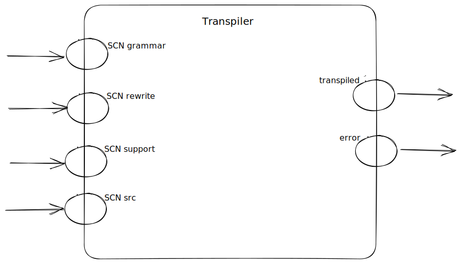
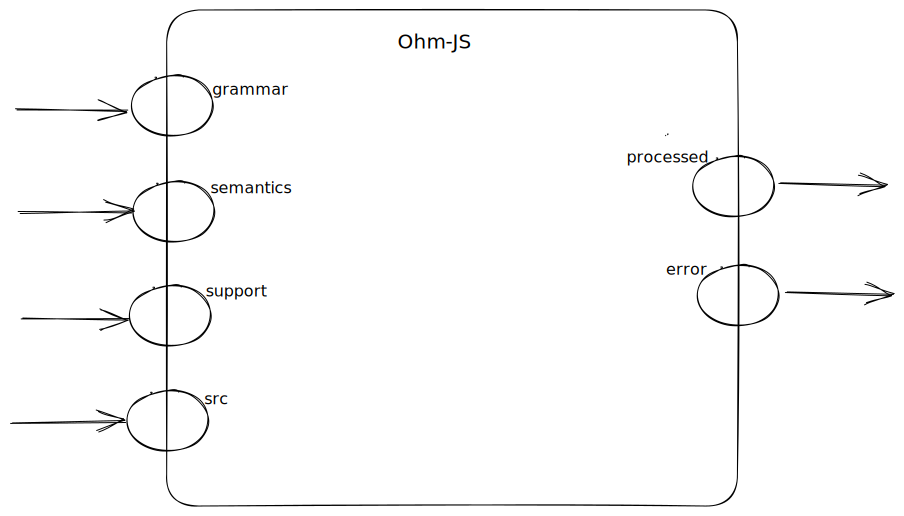
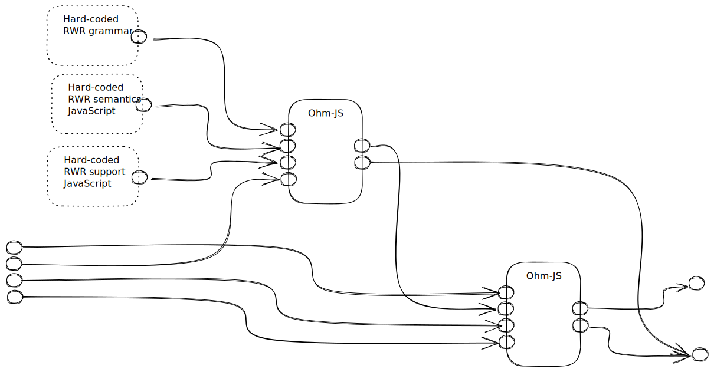
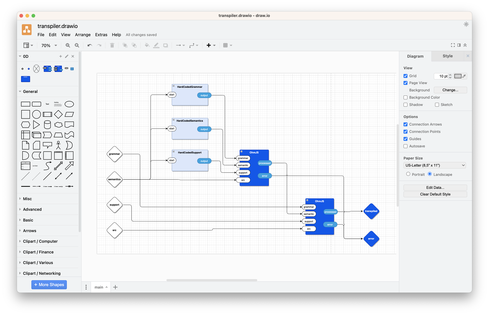

# 2023-09-02-DW0D Transpiler
# Transpiler Component

The top-level transpiler looks like this:
!

"SCN" means Solution Centric Notation.  Essentially a DSL, but more focussed.

The inputs all come from FileReader components.  The inputs are code, not filenames.

"SCN grammar" is source code in Ohm-JS format, i.e. a PEG grammar.

"SCN rewrite" is source code in *rwr* format.  It is used in conjunction with the pattern-matching grammar "SCN grammar" to direct the rewriting of code injected into the "SCN src" port.

"SCN support" is source code in JavaScript format.  The code is assumed to be correct and is fed to `eval()` for conversion to internal form.  Use `node.js` to parse the code and to get rid of mistakes, first.

"SCN src" is text in whatever format is required by the SCN (DSL).

The top-level transpiler is internally composed of several other components.

# Ohm-JS Component

!

The Ohm-JS component *looks* a lot like the *transpiler* component, but, they are different.

Here,

The "grammar" input port is the source code in Ohm-JS format, just like in the transpiler component, above.

The "semantics" input port is the JavaScript source code that is used to complete an Ohm-JS parser.  The source code is assumed to be error free and is not checked for syntactic errors.  Use `node.js` for pre-checking such source code.  The JavaScript source code is fed to the JavaScript `eval()` function.  `Eval()` is simply a runtime version of the JavaScript compiler.

The "support" input port is source code in JavaScript format.  The code is assumed to be correct and is fed to `eval()` for conversion to internal form.  Use `node.js` to parse the code and to get rid of mistakes, first.  This code is `eval()`ed and used as a helper for the rest of the Ohm-JS processing code.  In particular, the "support" code is a set of functions that can be called by the "semantics" code

The "src" input port is text to be processed by the Ohm-JS component.  Usually this "src" is in the form of some sort of DSL syntax invented by the programmer - the "user" of the Ohm-JS component.  The programmer specifies the desired syntax by supplying a grammar and a set of semantics.

# Implementation of the Transpiler Component

The transpiler component contains two (2) instances of the Ohm-JS component, plus some hard-wired source code.  The net effect of this implementation is to provide a simple API that looks like the transpiler component to the outside world.

!

Ideally, the hard-coded parts will be fired once at the beginning of time.  Practically, we need to trigger them.

In this design, we will send a trigger to each of the three (3) hard-coded parts.  Any trigger will do, as long as it causes the correct sequence of events to happen.  In this case, we will use the "semantics" input as a start signal to the three hard-wired components.  We don't actually care about the data contained in the start signal, we simply need to know that it has been fired.  Getting the "semantics" port to do double-duty is OK as long as the "semantics" data doesn't need to travel very far or use up too much time / latency.  In this case, we know that the hard-coded components are on the same CPU as the first Ohm-JS component, and, that they share memory.  In the future, we might optimize the system to detect that a lump of data is being used only as a trigger and optimize away any data copying that might happen.

Redrawn in draw.io, the transpiler implementation is

!